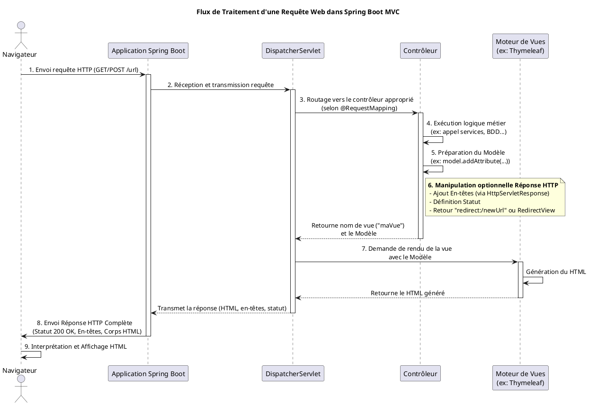

# Les contrôleurs

Avec Spring, il suffit d'annoter une classe avec `@Controller` pour qu'elle soit reconnue comme tel.

L’annotation `@Controller` permet à Spring de :

- détecter cette classe lors du scan des composants

- l’enregistrer comme bean Spring

- l’utiliser pour gérer les requêtes HTTP entrantes

#### Fonctionnement

Les méthodes dans une classe annotée avec `@Controller` sont généralement annotées
avec `@RequestMapping` ou d'autres annotations comme `@GetMapping`, `@PostMapping`
pour définir la route et la méthode qui invoquera ce contrôleur.

Ces méthodes retournent souvent des noms de vues (par exemple : home pour afficher home.html via Thymeleaf).

#### Différence avec @RestController

- `@Controller` est destiné à retourner des vues HTML

- `@RestController` (ajouté en Spring 4) combine `@Controller` et `@ResponseBody` cette annotation est utilisé pour des
  API REST qui retournent du JSON ou du XML.

## Le mapping

L’annotation `@RequestMapping` sert à faire correspondre une requête HTTP à une méthode d’un contrôleur. Elle peut être
utilisée au niveau d’une classe ou d’une méthode.

### Exemple de Request Mapping

**Sur une classe**

```java

@Controller
@RequestMapping("/users")
public class UserController {
    // Toutes les routes commencent par /users
}
```

**Sur une méthode**

```java

@Controller
public class UserController {

    // Route /list
    @RequestMapping("/list")
    public String listUsers() {
        return "userList";
    }

}
```

**Combinaison des deux**

```java

@Controller
@RequestMapping("/products")
public class ProductController {

    // route /products/all
    @RequestMapping("/all")
    public String showAll() {
        // Affiche productList.html
        return "productList";
    }

    // route /products/details
    @RequestMapping("/details")
    public String details() {
        // Affiche productDetails.html
        return "productDetails";
    }
}
```

#### Les mappings spécialisés

| Annotation       | Équivaut à                                      |
|------------------|-------------------------------------------------|
| `@GetMapping`    | `@RequestMapping(method = RequestMethod.GET)`   |
| `@PostMapping`   | `@RequestMapping(method = RequestMethod.POST)`  |
| `@PutMapping`    | `@RequestMapping(method = RequestMethod.PUT)`   |
| `@DeleteMapping` | `@RequestMapping(method = RequestMethod.DELETE) |

### Les options de `@RequestMapping`

| Option       | Type              | Description                                               | Exemple                                        |
|--------------|-------------------|-----------------------------------------------------------|------------------------------------------------|
| value / path | String([])        | URL(s) mappée(s) (synonymes)                              | @RequestMapping("/home")                       |
| method       | RequestMethod([]) | Méthode(s) HTTP acceptée(s)                               | @RequestMapping(method = RequestMethod.GET)    |
| params       | String([])        | Paramètre(s) requis ou exclus dans l’URL                  | @RequestMapping(params = "id")                 |
| headers      | String([])        | Header(s) requis pour traiter la requête                  | @RequestMapping(headers = "X-Auth")            |
| consumes     | String([])        | Type(s) MIME que la méthode peut consommer (Content-Type) | @RequestMapping(consumes = "application/json") |                                                                                                                          
| produces     | String([])        | Type(s) MIME produits par la méthode (Accept)             | @RequestMapping(produces = "application/json") |

> Il est possible de passer une seule option ou bien un tableau d'options d'où la notation `([])
#### Exemples

**Mapping basique avec `value` et `method`**

```java

@RequestMapping(value = "/login", method = RequestMethod.POST)
public String login() {
    return "dashboard";
}
```

**Avec `params` : ne répondre que si un paramètre est présent**

```java

@RequestMapping(value = "/search", params = "q")
public String search(@RequestParam String q) {
    return "searchResults";
}
```

**Avec `headers` : ne répondre que si un header est présent**

```java

@RequestMapping(value = "/secure", headers = "X-Auth-Token")
public String secureArea() {
    return "securePage";
}
```

**Avec `consumes` : requête doit avoir un Content-Type précis**

```java

@RequestMapping(value = "/json", consumes = "application/json")
@ResponseBody
public String receiveJson(@RequestBody String json) {
    return "Received";
}
```

** Avec `produces` : réponse avec un type MIME spécifique**

```java

@RequestMapping(value = "/api/data", produces = "application/json")
@ResponseBody
public Data getData() {
    return new Data("value");
}
```

#### Mapping multiples

Il est possible de définir plusieurs routes dans une annotation de mapping, il suffit de passer un tableau au lieu
d'une chaîne de caractères.

```java

@GetMapping({"/category", "/categorie"})
@ResponseBody
public String category() {
    return "Catégorie ";
}
```

## Gestion de la réponse

Dans une application web MVC (Modèle-Vue-Contrôleur), le contrôleur joue un rôle central. Après avoir traité une requête
HTTP entrante, il ne se contente pas de sélectionner une vue et de lui fournir un modèle de données. Il doit aussi
souvent manipuler la *réponse* HTTP elle-même pour influencer le comportement du navigateur client. Cela inclut des
opérations essentielles comme rediriger l'utilisateur vers une autre page ou ajouter des informations spécifiques dans
les en-têtes HTTP. Spring Boot, en s'appuyant sur Spring MVC, offre plusieurs mécanismes élégants pour accomplir ces
tâches sans devoir manipuler directement les objets `Servlet` bruts, bien que cela reste possible. Ce chapitre 
explore ces mécanismes dans le contexte d'applications web servant des pages HTML.

---

### Le Contexte : Requête et Réponse HTTP

Rappelons brièvement le flux d'une requête web :

1. Le navigateur envoie une requête HTTP (GET, POST, etc.) à une URL.
2. Le serveur (ici, l'application Spring Boot) reçoit la requête.
3. Le `DispatcherServlet` de Spring MVC route la requête vers le contrôleur approprié.
4. Le contrôleur exécute sa logique métier.
5. Le contrôleur détermine la vue à afficher et prépare le modèle de données.
6. **Le contrôleur peut également spécifier des instructions particulières pour la réponse HTTP (statut, en-têtes,
   redirection).**
7. Le moteur de vues (ex: Thymeleaf) génère le HTML en utilisant le modèle.
8. Le serveur renvoie la réponse HTTP complète (statut, en-têtes, corps HTML) au navigateur.
9. Le navigateur interprète la réponse (affiche le HTML, suit la redirection, etc.).



---

### Gestion des Redirections

Une redirection HTTP (typiquement avec le statut 302 Found ou 303 See Other) demande au navigateur d'effectuer une
nouvelle requête vers une URL différente. C'est une technique fondamentale dans le développement web.

#### Pourquoi utiliser les Redirections ?

* **Pattern POST-Redirect-GET (PRG) :** C'est le cas d'usage le plus courant. Après la soumission réussie d'un
  formulaire (POST), il est crucial de rediriger l'utilisateur vers une page de confirmation (GET). Cela évite le
  problème de la "double soumission" si l'utilisateur rafraîchit la page de confirmation (qui serait le résultat du POST
  sinon).
* **Navigation après une action :** Après une action comme la suppression d'un élément, on redirige souvent
  l'utilisateur vers la liste mise à jour.
* **URL Canoniques / SEO :** Rediriger des URLs alternatives vers une URL préférée.
* **Contrôle d'accès :** Rediriger les utilisateurs non authentifiés vers une page de connexion.

#### Méthode 1 : Le préfixe `redirect:`

La manière la plus simple et la plus fréquente d'effectuer une redirection dans Spring MVC est de retourner une `String`
préfixée par `redirect:` depuis la méthode du contrôleur.

* **Fonctionnement :** Spring MVC détecte ce préfixe spécial. Au lieu de chercher une vue nommée "redirect:/...", il
  interprète la chaîne suivante comme l'URL de redirection et envoie une réponse HTTP avec le statut 302 (Found) et
  l'en-tête `Location` pointant vers cette URL.
* **URL Relatives ou Absolues :**
    * `redirect:/users` : Redirection relative au contexte de l'application. Si l'application tourne sur
      `http://localhost:8080/myapp`, cela redirige vers `http://localhost:8080/myapp/users`. C'est la forme la plus
      courante.
    * `redirect:profile` : Redirection relative au chemin courant. Si la requête était sur `/users/edit`, cela redirige
      vers `/users/profile`. Moins fréquent et potentiellement source d'erreur si mal maîtrisé.
    * `redirect:http://example.com` : Redirection vers une URL absolue externe.

**Exemple de Code :**

```java
package fr.formation.spring.controller;

import fr.formation.spring.model.UserForm; // Supposons une classe UserForm
import org.springframework.stereotype.Controller;
import org.springframework.web.bind.annotation.GetMapping;
import org.springframework.web.bind.annotation.PostMapping;
import org.springframework.web.bind.annotation.RequestMapping;
import org.springframework.web.servlet.mvc.support.RedirectAttributes;

@Controller
@RequestMapping("/users")
public class UserController {

    // Affiche le formulaire de création
    @GetMapping("/new")
    public String displayUserForm(UserForm userForm) {
        // userForm est ajouté au modèle implicitement
        return "user-form"; // Nom de la vue (ex: user-form.html avec Thymeleaf)
    }

    // Traite la soumission du formulaire
    @PostMapping("/create")
    public String createUser(
            UserForm userForm,
            RedirectAttributes redirectAttributes
    ) {
        // Logique pour sauvegarder l'utilisateur...
        // userService.save(userForm); 
        System.out.println("Utilisateur créé (simulé) : " + userForm.getName());

        // Ajoute un message flash pour la page de confirmation
        redirectAttributes.addFlashAttribute("message",
                "Utilisateur créé avec succès !");

        // Redirige vers la page de confirmation (pattern PRG)
        // L'URL sera /users/creation-success
        return "redirect:/users/creation-success";
    }

    // Affiche la page de confirmation après redirection
    @GetMapping("/creation-success")
    public String displayCreationSuccess() {
        // La vue peut afficher le message flash ajouté via RedirectAttributes
        return "user-success"; // Nom de la vue (ex: user-success.html)
    }
}
```

**Cas d'utilisation typique :** Traitement de formulaires (PRG).

**Bonnes Pratiques :**

* Utiliser systématiquement le pattern PRG après un POST modifiant des données.
* Utiliser `RedirectAttributes` pour passer des messages ou des données simples à la page cible de la redirection (
  attributs "flash" qui ne survivent qu'à une seule redirection).

#### 3.3. Méthode 2 : Utilisation de `RedirectView`

Pour plus de contrôle ou pour construire dynamiquement l'URL de redirection, on peut retourner un objet `RedirectView`.

* **Fonctionnement :** `RedirectView` est une implémentation de l'interface `View` de Spring. Retourner une instance de
  `RedirectView` indique explicitement à Spring d'effectuer une redirection.
* **Avantages :**
    * Permet de définir le code de statut HTTP (par défaut 302, mais on peut forcer 303 See Other, plus sémantique pour
      PRG).
    * Permet de construire l'URL de manière programmatique.
    * Peut encoder automatiquement les paramètres d'URL.

**Exemple de Code :**

```java
package fr.formation.spring.controller;

import org.springframework.stereotype.Controller;
import org.springframework.web.bind.annotation.GetMapping;
import org.springframework.web.bind.annotation.PostMapping;
import org.springframework.web.bind.annotation.RequestMapping;
import org.springframework.web.bind.annotation.RequestParam;
import org.springframework.web.servlet.view.RedirectView;
import org.springframework.http.HttpStatus;

@Controller
@RequestMapping("/products")
public class ProductController {

    // Supposons une action de recherche qui redirige vers une page de résultats
    @PostMapping("/search")
    public RedirectView searchProduct(
            @RequestParam("query") String searchQuery
    ) {
        // Construit l'URL de redirection dynamiquement
        String targetUrl = "/products/results?q=" + searchQuery;

        RedirectView redirectView = new RedirectView(targetUrl);
        // Optionnel: Utiliser 303 See Other pour PRG
        redirectView.setStatusCode(HttpStatus.SEE_OTHER);
        // Optionnel: Ne pas exposer le modèle dans l'URL si non nécessaire
        redirectView.setExposeModelAttributes(false);

        System.out.println("Redirection vers : " + targetUrl);
        return redirectView;
    }

    // Page affichant les résultats (la cible de la redirection)
    @GetMapping("/results")
    public String displaySearchResults(
            @RequestParam("q") String query
            // Model model // Pour ajouter les résultats à la vue
    ) {
        System.out.println("Affichage des résultats pour : " + query);
        // Logique pour récupérer les produits correspondants...
        // model.addAttribute("products", productService.search(query));
        // model.addAttribute("searchQuery", query);
        return "product-results"; // Nom de la vue
    }
}
```

**Cas d'utilisation typique :** Redirections complexes, construction dynamique d'URL, besoin de spécifier un statut HTTP
différent de 302.

**Bonnes Pratiques :**

* Utiliser `HttpStatus.SEE_OTHER` (303) pour les redirections après un POST (PRG), car c'est sémantiquement plus
  correct (indique que la *ressource* résultante de l'action se trouve à la nouvelle URL, à récupérer via GET).
* Faire attention à l'encodage des paramètres si l'URL est construite manuellement (bien que `RedirectView` puisse
  aider). `UriComponentsBuilder` est un outil utile pour construire des URLs proprement.

---

### Exercice 1 : Redirection après Connexion

**Énoncé :**
Créez un contrôleur `LoginController` avec :

1. Une méthode `GET` sur `/login` qui affiche un formulaire de connexion simple (pas besoin de créer le HTML, juste
   retourner le nom de la vue "login-form").
2. Une méthode `POST` sur `/login` qui simule une tentative de connexion.
    * Si le `username` est "admin" et `password` est "password", redirigez vers `/dashboard` avec un message flash "
      Connexion réussie".
    * Sinon, redirigez de nouveau vers `/login` avec un message flash "Identifiants incorrects".
3. Une méthode `GET` sur `/dashboard` qui affiche une page de tableau de bord (retourner le nom de la vue "dashboard").

Utilisez la méthode du préfixe `redirect:` et `RedirectAttributes`.

#### **Correction Exercice 1** {collapsible="true"}

```java
package fr.formation.spring.controller;

import org.springframework.stereotype.Controller;
import org.springframework.web.bind.annotation.GetMapping;
import org.springframework.web.bind.annotation.PostMapping;
import org.springframework.web.bind.annotation.RequestMapping;
import org.springframework.web.bind.annotation.RequestParam;
import org.springframework.web.servlet.mvc.support.RedirectAttributes;

@Controller
@RequestMapping("/")
public class LoginController {

    // Affiche le formulaire de login
    @GetMapping("/login")
    public String showLoginForm() {
        return "login-form"; // Nom de la vue
    }

    // Traite la soumission du formulaire de login
    @PostMapping("/login")
    public String processLogin(
            @RequestParam("username") String username,
            @RequestParam("password") String password,
            RedirectAttributes redirectAttributes
    ) {
        // Logique de vérification (simpliste ici)
        if ("admin".equals(username) && "password".equals(password)) {
            // Connexion réussie
            redirectAttributes.addFlashAttribute("message",
                    "Connexion réussie ! Bienvenue.");
            // Redirection vers le tableau de bord
            return "redirect:/dashboard";
        } else {
            // Échec de la connexion
            redirectAttributes.addFlashAttribute("error",
                    "Identifiants incorrects.");
            // Redirection vers le formulaire de login
            return "redirect:/login";
        }
    }

    // Affiche le tableau de bord
    @GetMapping("/dashboard")
    public String showDashboard() {
        // La vue dashboard peut accéder au message flash si présent
        return "dashboard"; // Nom de la vue
    }
}
```

---

### Ajout d'En-têtes HTTP

Les en-têtes HTTP transportent des métadonnées sur la requête ou la réponse. Côté serveur, ajouter des en-têtes à la
réponse permet de contrôler divers aspects du comportement du client (navigateur, proxy).

#### Pourquoi ajouter des En-têtes ?

* **Gestion du Cache :** Indiquer au navigateur comment mettre en cache la ressource (`Cache-Control`, `Expires`,
  `Pragma`).
* **Sécurité :** Définir des politiques de sécurité (`Content-Security-Policy`, `X-Frame-Options`,
  `Strict-Transport-Security`).
* **Type de Contenu :** Spécifier explicitement le type MIME de la réponse (`Content-Type`). Bien que Spring le fasse
  souvent automatiquement pour les vues, on peut vouloir le surcharger.
* **Nom de Fichier pour Téléchargement :** Suggérer un nom de fichier au navigateur (`Content-Disposition`).
* **Informations Personnalisées :** Ajouter des en-têtes spécifiques à l'application (souvent préfixés par `X-`).

#### Méthode : Injection de `HttpServletResponse`

La façon la plus directe et la plus flexible de manipuler les en-têtes (et d'autres aspects de la réponse comme le
statut ou les cookies) est d'injecter l'objet `HttpServletResponse` directement dans la méthode du contrôleur.

* **Fonctionnement :** Spring MVC permet de déclarer `HttpServletResponse` comme paramètre d'une méthode de contrôleur.
  Spring injectera alors l'objet réponse associé à la requête courante. On peut ensuite utiliser les méthodes de cet
  objet (`setHeader`, `addHeader`, `setContentType`, etc.) pour manipuler la réponse *avant* que la vue ne soit rendue
  ou la redirection effectuée.

**Exemple de Code :**

```java
package fr.formation.spring.controller;

import jakarta.servlet.http.HttpServletResponse; // Attention: package jakarta... pour Spring Boot 3+
// import javax.servlet.http.HttpServletResponse; // Pour Spring Boot 2.x
import org.springframework.stereotype.Controller;
import org.springframework.web.bind.annotation.GetMapping;
import org.springframework.web.bind.annotation.RequestMapping;

@Controller
@RequestMapping("/reports")
public class ReportController {

    @GetMapping("/confidential")
    public String showConfidentialReport(HttpServletResponse response) {
        // Ajoute des en-têtes pour désactiver le cache
        response.setHeader("Cache-Control", "no-cache, no-store, must-revalidate");
        response.setHeader("Pragma", "no-cache"); // Compatibilité HTTP/1.0
        response.setDateHeader("Expires", 0); // Proxy caches

        // Ajoute un en-tête personnalisé
        response.setHeader("X-Report-Generated", Long.toString(System.currentTimeMillis()));

        // Ajoute un en-tête de sécurité simple
        response.setHeader("X-Content-Type-Options", "nosniff");

        System.out.println("En-têtes ajoutés à la réponse pour /reports/confidential");

        // Retourne le nom de la vue normalement
        return "confidential-report"; // Nom de la vue
    }

    // Exemple (théorique) pour suggérer un nom de fichier
    @GetMapping("/download")
    public String downloadReport(HttpServletResponse response) {
        // Indique que le contenu doit être traité comme une pièce jointe
        // et suggère un nom de fichier.
        response.setHeader("Content-Disposition",
                "attachment; filename=\"report.txt\"");

        // Important: Il faudrait aussi définir le Content-Type approprié
        // et écrire le contenu du fichier dans response.getOutputStream()
        // Ce qui sort du cadre du simple retour de nom de vue.
        // Pour les vrais téléchargements, utiliser ResponseEntity<Resource> 
        // est souvent plus adapté, même hors contexte REST pur.

        System.out.println("En-tête Content-Disposition ajouté.");

        // Dans un cas simple où on retourne juste une vue, 
        // cet en-tête n'aura pas l'effet de télécharger un fichier.
        // Cet exemple illustre juste l'ajout de l'en-tête.
        return "report-download-page"; // Une vue qui pourrait contenir un lien
    }
}
```

**Cas d'utilisation typique :** Définir des politiques de cache spécifiques, ajouter des en-têtes de sécurité, fournir
des métadonnées personnalisées.

**Bonnes Pratiques :**

* Ajouter les en-têtes *avant* de retourner le nom de la vue ou d'effectuer une redirection.
* Bien comprendre la signification de chaque en-tête HTTP standard (MDN Web Docs est une excellente ressource).
* Pour les en-têtes de sécurité, envisager d'utiliser des configurations globales (par exemple avec Spring Security)
  plutôt que de les ajouter manuellement dans chaque contrôleur, pour assurer la cohérence.
* Soyez conscient que `HttpServletResponse` est une API de bas niveau (Servlet API). Utilisez-la lorsque les
  abstractions de Spring ne suffisent pas ou pour un contrôle fin.

---

### Exercice 2 : Définition d'En-têtes pour une Page Spécifique

**Énoncé :**
Créez une méthode de contrôleur `GET` sur `/legacy-info` dans un `InfoController`. Cette méthode doit :

1. Retourner le nom de vue "legacy-page".
2. Ajouter un en-tête HTTP `X-Compatibility-Mode` avec la valeur `IE7`.
3. Ajouter un en-tête `Cache-Control` avec la valeur `public, max-age=3600` pour indiquer que la page peut être mise en
   cache pendant une heure.

Utilisez l'injection de `HttpServletResponse`.

#### **Correction Exercice 2** {collapsible="true"}

```java
package fr.formation.spring.controller;

import jakarta.servlet.http.HttpServletResponse;
import org.springframework.stereotype.Controller;
import org.springframework.web.bind.annotation.GetMapping;
import org.springframework.web.bind.annotation.RequestMapping;

@Controller
@RequestMapping("/info")
public class InfoController {

    @GetMapping("/legacy-info")
    public String showLegacyInfo(HttpServletResponse response) {
        // Ajoute l'en-tête de compatibilité
        response.setHeader("X-Compatibility-Mode", "IE7");

        // Ajoute l'en-tête de cache
        response.setHeader("Cache-Control", "public, max-age=3600");

        System.out.println("En-têtes X-Compatibility-Mode et Cache-Control ajoutés.");

        // Retourne le nom de la vue
        return "legacy-page";
    }
}
```

---

### Conseils et Bonnes Pratiques Générales

* **Privilégier les abstractions Spring :** Utiliser `redirect:` et `RedirectAttributes` pour les redirections simples.
  Utiliser `RedirectView` pour les cas plus complexes. Recourir à `HttpServletResponse` pour la manipulation fine des
  en-têtes lorsque nécessaire.
* **Pattern PRG :** C'est une pratique essentielle pour éviter les problèmes de double soumission de formulaire.
  Toujours rediriger après un POST réussi qui modifie l'état de l'application.
* **Sécurité :** Ne pas négliger les en-têtes de sécurité (`Content-Security-Policy`, `X-Frame-Options`,
  `X-Content-Type-Options`, `Strict-Transport-Security`). Spring Security offre une configuration centralisée et robuste
  pour ces en-têtes.
* **Cache :** Comprendre les directives `Cache-Control` est crucial pour les performances et la fraîcheur des données.
  Définir des politiques de cache appropriées pour les différentes ressources (pages statiques, pages dynamiques,
  données confidentielles).
* **Statuts HTTP :** Utiliser les codes de statut HTTP de manière sémantique (ex: 303 See Other pour PRG au lieu de 302
  Found si pertinent).
* **URLs :** Préférer les URLs relatives au contexte (`redirect:/path`) pour les redirections internes à l'application
  pour une meilleure portabilité.

---

### Cas d'Utilisation Courants (Récapitulatif)

* **Redirection après soumission de formulaire :** `return "redirect:/confirmation";` avec `RedirectAttributes`.
* **Redirection vers la page de connexion si non authentifié :** Souvent géré par le framework de sécurité (comme Spring
  Security), mais peut être fait manuellement via redirection.
* **Redirection après une action (suppression, mise à jour) :** `return "redirect:/liste";`
* **Désactivation du cache pour des données sensibles :** Injection de `HttpServletResponse` et
  `response.setHeader("Cache-Control", "no-cache, no-store");`.
* **Ajout d'en-têtes de sécurité de base :** `response.setHeader("X-Frame-Options", "DENY");`.
* **Construction d'URL de redirection complexe :** Utilisation de `RedirectView` ou `UriComponentsBuilder`.


---

## La gestion des paramètres en entrée

Un contrôleur peut recevoir des paramètres de plusieurs façons.

- Depuis l'URL (deux méthodes)
- Depuis le corps de la requête (contenu JSON ou XML)
- Depuis un formulaire
- Depuis les cookies
- Depuis la session
- Depuis les en-têtes HTTP

Voici la liste des annotations correspondantes. Toutes ces annotations se placent dans la signature de la méthode.
Spring se charge d'injecter les valeurs dans les arguments. Il est bien entendu possible de placer de multiples
annotations dans une méthode.

| Source            | Annotation Spring   | Exemple d’utilisation                    |
|-------------------|---------------------|------------------------------------------|
| URL (query param) | `@RequestParam`     | `?name=John`                             |
| URL (path param)  | `@PathVariable`     | `/users/42`                              |
| Corps (JSON/XML)  | `@RequestBody`      | POST avec JSON dans le body              |
| En-tête HTTP      | `@RequestHeader`    | Lire `Authorization`, `User-Agent`, etc. |
| Cookie            | `@CookieValue`      | Lire des cookies                         |
| Formulaire        | `@ModelAttribute`   | Bind un formulaire HTML à un objet Java  |
| Session           | `@SessionAttribute` | Lire une variable de session             |

### Attributs et comportement communs

### Request Param

L'annotation `@RequestParam` se place dans la signature de la méthode.
Le nom de la variable correspond à celui du paramètre attendu.

```java
// attendu : /greet?name=...
@GetMapping("/greet")
@ResponseBody
public String greet(@RequestParam String name) {
    return "Bonjour " + name;
}
```

#### Transtypage automatique

Lors de l'injection d'un paramètre `Spring` effectue une conversion automatique en fonction du type de l'argument.

**Liste des types convertibles**

| Type Java      | Exemple d’URL            | Résultat                     |
|----------------|--------------------------|------------------------------|
| `int`          | `?age=25`                | `25`                         |
| `boolean`      | `?active=true`           | `true`                       |
| `double`       | `?score=9.5`             | `9.5`                        |
| `LocalDate`    | `?date=2024-12-01`       | `2024-12-01`                 |
| `List<String>` | `?tags=java,spring,boot` | `["java", "spring", "boot"]` |
| Enum           | `?role=ADMIN`            | `Role.ADMIN`                 |

**Erreurs possibles et exceptions retournées**

- Valeur absente (sans défaut) :    `MissingServletRequestParameterException`
- Format incompatible :    `TypeMismatchException`
- Enum non reconnu :    `IllegalArgumentException`

#### Les attributs de `@RequestParam`

| Élément                    | Description                                                |
|----------------------------|------------------------------------------------------------|
| `required = true` (défaut) | Déclenche une erreur si le paramètre est absent            |
| `defaultValue`             | Fournit une valeur par défaut si le paramètre est manquant |

**Exemple avec une valeur par défaut**

```java

@GetMapping("/hello")
@ResponseBody
public String hello(
        @RequestParam(value = "user", required = false, defaultValue = "invité")
        String username
) {
    return "Salut " + username;
}
```

#### Récupération de tous les paramètres

Si le type de l'argument est un Map, `Spring` injectera l'ensemble des informations du querystring dans cette
collection.
Ce comportement est valable pour tous les types de paramètres.

```java

@GetMapping("/params")
@ResponseBody
public String allParams(@RequestParam Map<String, String> params) {
    return "Paramètres reçus : " + params.toString();
}
```

### Path Variable

Similaire à `@RequestParam`, l'annotation `@PathVariable` se place également dans la signature de la méthode,
Cependant le paramètre est encadré par des accolades.
Par défaut, le nom de la variable correspond à celui du paramètre attendu.

```java
// Attendu /users/5
@GetMapping("/users/{id}")
@ResponseBody
public String getUser(@PathVariable Long id) {
    return "User ID : " + id;
}
```

Si le nom du paramètre diffère du nom de l'argument, il faut préciser la correspondance dans les attributs de
l'annotation.

```java
// Attendu /users/5
@GetMapping("/users/{id}")
@ResponseBody
// Ici on ajoute la correspondance dans @PathVariable
public String getUser(@PathVariable("id") Long userId) {
    return "User ID : " + id;
}
```

#### Les attributs de @PathVariable

| Option     | Type      | Description                                    | Exemple                               |
|------------|-----------|------------------------------------------------|---------------------------------------|
| `value`    | `String`  | Nom du paramètre tel qu’il apparaît dans l’URL | `@PathVariable("id") Long userId`     |
| `name`     | `String`  | Synonyme de `value` (depuis Spring 4.3)        | `@PathVariable(name = "slug") String` |
| `required` | `boolean` | Paramètre obligatoire ? (`true` par défaut)    | `@PathVariable(required = false)`     |

#### Paramètres optionnels

En pratique, `@PathVariable(required = false)` n’a aucun effet
si le chemin n’est pas défini comme optionnel dans le @GetMapping.

`Spring` exige que tous les segments {} présents dans le chemin soient fournis,
sauf s'il existe une route qui omet le paramètre :

```java

@GetMapping({"/category", "/category/{name}"})
@ResponseBody
public String category(
        @PathVariable(required = false) String name
) {
    return "Catégorie : " + (name != null ? name : "générique");
}
```

### Request Body

`@RequestBody` correspond à du contenu `JSON` ou `XML` envoyé dans le corps de la requête `HTTP`. `Spring` désérialise
ce contenu automatiquement pour le convertir en objet.

```java

@PostMapping("/api/users")
@ResponseBody
public String createUser(@RequestBody User user) {
    return "Bienvenue " + user.getName();
}
```

### Request Header

Injecte la valeur d'un en-tête `HTTP` dans un argument de la méthode.

```java

@GetMapping("/device")
@ResponseBody
public String detect(@RequestHeader("User-Agent") String agent) {
    return "Ton navigateur : " + agent;
}
```

### Cookie Value

```java

@GetMapping("/welcome")
@ResponseBody
public String welcome(@CookieValue("sessionId") String sessionId) {
    return "Session ID : " + sessionId;
}
```

### Model Attribute

Hydrate automatiquement un objet avec la saisie d'un formulaire.

```java

@PostMapping("/register")
@ResponseBody
public String register(@ModelAttribute User user) {
    return "Bienvenue " + user.getName();
}
```

### Session Attribute

Injecte la valeur d'une variable de session dans un argument.
S'il s'agit d'un objet sérialisé, le simple fait de caster désérialise

```java

@GetMapping("/profile")
public String profile(@SessionAttribute("user") User user) {
    return "Bonjour " + user.getName();
}
```


