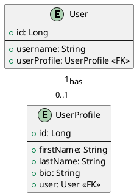
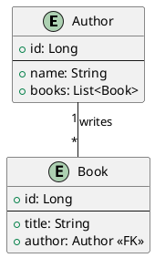
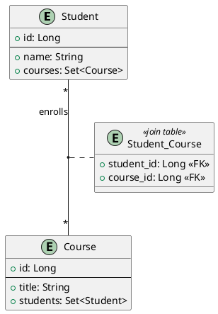
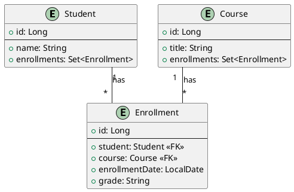

# Spring Data JPA

### Qu'est-ce que JPA ?

JPA (Java Persistence API) est une **spécification** Java standard (faisant partie de Jakarta EE, anciennement Java EE)
qui décrit comment gérer les données relationnelles dans les applications Java. Elle fournit un ensemble d'interfaces et
d'annotations pour définir un mapping Objet-Relationnel (ORM - Object-Relational Mapping). JPA n'est *pas* une
implémentation en soi, mais un standard. Les implémentations populaires incluent Hibernate (la plus courante),
EclipseLink et OpenJPA.

**Objectif principal de JPA :** Permettre aux développeurs de manipuler des objets Java "normaux" (appelés Entités) et
de laisser le framework JPA gérer la traduction vers les opérations SQL nécessaires pour persister, lire, mettre à jour
ou supprimer ces objets dans une base de données relationnelle.

### Qu'est-ce que Spring Data JPA ?

Spring Data JPA est un module du projet **Spring Data**. Son but est de **simplifier considérablement** l'implémentation
des couches d'accès aux données basées sur JPA. Il s'appuie sur la spécification JPA et une implémentation
sous-jacente (généralement Hibernate par défaut avec Spring Boot) mais fournit une abstraction supplémentaire
puissante : les **Repositories**.

**Avantages clés de Spring Data JPA :**

1. **Réduction du code répétitif (Boilerplate) :** Plus besoin d'écrire manuellement les implémentations des DAO (Data
   Access Objects) pour les opérations CRUD (Create, Read, Update, Delete) de base.
2. **Repositories déclaratifs :** Il suffit de définir une interface de repository. Spring Data JPA fournit
   l'implémentation automatiquement au runtime.
3. **Requêtes dérivées (Derived Queries) :** Génération automatique de requêtes SQL/JPQL à partir du nom des méthodes
   définies dans l'interface du repository.
4. **Requêtes personnalisées faciles :** Support pour écrire des requêtes JPQL ou SQL natives via des annotations (
   `@Query`).
5. **Intégration transparente avec Spring :** Gestion des transactions, injection de dépendances, configuration
   simplifiée, etc.
6. **Support de la pagination et du tri.**

**Cas d'utilisation :** Spring Data JPA est idéal pour la plupart des applications Java d'entreprise ou web qui
nécessitent une interaction avec une base de données relationnelle. Il accélère le développement tout en favorisant des
pratiques de codage propres et maintenables pour la couche de persistance.

## Configuration du Projet

Pour utiliser Spring Data JPA, une configuration minimale est requise. Avec Spring Boot, cette configuration est
grandement simplifiée.

### Dépendances (Maven)

Il faut ajouter les dépendances suivantes dans le fichier `pom.xml` :

```xml

<dependencies>
    <!-- Dépendance principale pour Spring Data JPA -->
    <dependency>
        <groupId>org.springframework.boot</groupId>
        <artifactId>spring-boot-starter-data-jpa</artifactId>
    </dependency>

    <!-- Dépendance pour la base de données (exemple avec H2, une base en mémoire) -->
    <dependency>
        <groupId>com.h2database</groupId>
        <artifactId>h2</artifactId>
        <scope>runtime</scope> <!-- Souvent utilisée pour le développement/test -->
    </dependency>

    <!-- Alternative : Dépendance pour PostgreSQL -->
    <!--
    <dependency>
        <groupId>org.postgresql</groupId>
        <artifactId>postgresql</artifactId>
        <scope>runtime</scope>
    </dependency>
    -->

    <!-- Optionnel mais utile : Lombok pour réduire le code boilerplate (getters, setters...) -->
    <dependency>
        <groupId>org.projectlombok</groupId>
        <artifactId>lombok</artifactId>
        <optional>true</optional>
    </dependency>

    <!-- Dépendances Spring Boot de base (souvent déjà présentes) -->
    <dependency>
        <groupId>org.springframework.boot</groupId>
        <artifactId>spring-boot-starter-web</artifactId>
    </dependency>
    <dependency>
        <groupId>org.springframework.boot</groupId>
        <artifactId>spring-boot-starter-test</artifactId>
        <scope>test</scope>
    </dependency>
</dependencies>
```

### Configuration de la Source de Données

La configuration de la connexion à la base de données se fait généralement dans le fichier `application.properties` (ou
`application.yml`).

**Exemple pour H2 (base en mémoire) :**

```properties
# Configuration de la source de données H2
spring.datasource.url=jdbc:h2:mem:testdb # URL de la base en mémoire nommée 'testdb'
spring.datasource.driverClassName=org.h2.Driver # Classe du driver JDBC
spring.datasource.username=sa # Utilisateur (par défaut pour H2)
spring.datasource.password=# Mot de passe (vide par défaut pour H2)
# Configuration JPA/Hibernate
spring.jpa.database-platform=org.hibernate.dialect.H2Dialect # Dialecte SQL spécifique à H2
spring.jpa.hibernate.ddl-auto=update # Stratégie de génération/mise à jour du schéma (create, create-drop, update, validate, none)
spring.jpa.show-sql=true # Afficher les requêtes SQL générées dans les logs (utile pour le debug)
spring.jpa.properties.hibernate.format_sql=true # Formater le SQL affiché pour une meilleure lisibilité
# Activer la console H2 (accessible via http://localhost:8080/h2-console par défaut)
spring.h2.console.enabled=true
spring.h2.console.path=/h2-console # Chemin d'accès à la console
```

**Exemple pour PostgreSQL :**

```properties
# Configuration de la source de données PostgreSQL
spring.datasource.url=jdbc:postgresql://localhost:5432/mydatabase # URL de votre base PostgreSQL
spring.datasource.username=myuser # Votre utilisateur PostgreSQL
spring.datasource.password=mypassword # Votre mot de passe PostgreSQL
# Configuration JPA/Hibernate
spring.jpa.database-platform=org.hibernate.dialect.PostgreSQLDialect # Dialecte SQL spécifique à PostgreSQL
spring.jpa.hibernate.ddl-auto=update # ou validate en production
spring.jpa.show-sql=true
spring.jpa.properties.hibernate.format_sql=true
```

**Conseil (`ddl-auto`) :**

* `create`: Crée le schéma à chaque démarrage, détruisant les données précédentes. Utile pour les tests.
* `create-drop`: Crée le schéma au démarrage et le supprime à l'arrêt. Utile pour les tests.
* `update`: Met à jour le schéma existant (ajoute des colonnes, etc.) sans supprimer les données. Pratique en
  développement, mais **risqué en production** (peut échouer sur des changements complexes).
* `validate`: Valide que le schéma de la base correspond aux entités mappées, sans rien modifier. Recommandé pour la
  production.
* `none`: Ne fait rien concernant le schéma. Nécessite une gestion manuelle (via des outils comme Flyway ou Liquibase,
  ce qui est la meilleure pratique pour la production).

### Activation des Repositories JPA

Avec Spring Boot, si la dépendance `spring-boot-starter-data-jpa` est présente, la configuration est automatique.
L'annotation `@EnableJpaRepositories` est implicitement ajoutée. Elle demande à Spring de scanner le package (et ses
sous-packages) de la classe annotée (généralement la classe principale de l'application) pour trouver les interfaces
héritant de `JpaRepository` (ou d'autres interfaces Spring Data).

```java
package fr.formation.spring.demo;

import org.springframework.boot.SpringApplication;
import org.springframework.boot.autoconfigure.SpringBootApplication;

// Pas nécessaire avec Spring Boot si les repos sont dans le même package ou un sous-package
// import org.springframework.data.jpa.repository.config.EnableJpaRepositories; 
@SpringBootApplication
// @EnableJpaRepositories // Peut être utilisé pour spécifier un package différent pour les repositories
public class MyApplication {

    public static void main(String[] args) {
        SpringApplication.run(MyApplication.class, args);
    }
}
```

## Concepts Fondamentaux

### Entités JPA (`@Entity`)

Une entité est une classe Java simple (POJO - Plain Old Java Object) qui est mappée à une table dans la base de données.

* **`@Entity` :** Marque la classe comme une entité JPA.
* **`@Table(name = "nom_table")` :** (Optionnel) Spécifie le nom de la table dans la base de données. Si omis, le nom de
  la classe est généralement utilisé.
* **`@Id` :** Marque un champ comme clé primaire de l'entité.
* **`@GeneratedValue(strategy = ...)` :** Spécifie comment la valeur de la clé primaire est générée (par exemple,
  `GenerationType.IDENTITY` pour une colonne auto-incrémentée, `GenerationType.SEQUENCE`, `GenerationType.AUTO`).
* **`@Column(name = "nom_colonne", nullable = false, length = 100)` :** (Optionnel) Mappe un champ à une colonne
  spécifique et définit ses propriétés (nom, nullabilité, longueur, etc.).
* **Annotations de mapping de type :** `@Temporal` (pour les dates), `@Enumerated` (pour les enums), `@Lob` (pour les
  grands objets), `@Transient` (pour ignorer un champ lors de la persistance).

**Exemple :**

```java
package fr.formation.spring.demo.model;

import jakarta.persistence.*; // Utilise jakarta.persistence.* avec Spring Boot 3+
// import javax.persistence.*; // Utilise javax.persistence.* avec Spring Boot 2.x
import lombok.Getter;
import lombok.Setter;
import lombok.NoArgsConstructor;
import lombok.AllArgsConstructor;

import java.time.LocalDate; // Utiliser java.time pour les dates modernes

@Entity // Marque cette classe comme une entité JPA
@Table(name = "users") // Mappe à la table "users"
@Getter // Lombok: génère les getters
@Setter // Lombok: génère les setters
@NoArgsConstructor // Lombok: génère un constructeur sans arguments (requis par JPA)
@AllArgsConstructor // Lombok: génère un constructeur avec tous les arguments
public class User {

    @Id // Clé primaire
    @GeneratedValue(strategy = GenerationType.IDENTITY) // Stratégie d'auto-incrémentation (commune)
    private Long id;

    @Column(name = "user_name", nullable = false, unique = true, length = 50) // Colonne spécifique
    private String username; // Nom d'utilisateur

    @Column(nullable = false) // La colonne s'appellera "email" par défaut
    private String email; // Adresse email

    @Column(name = "registration_date") // Colonne pour la date d'inscription
    private LocalDate registrationDate; // Date d'inscription

    private boolean active; // Un champ booléen (souvent mappé à un type booléen ou entier en BDD)

    // Constructeurs, Getters, Setters, toString, equals/hashCode sont importants
    // Lombok aide à réduire ce code répétitif
}
```

### Repositories Spring Data (`JpaRepository`)

Un repository est une interface qui fournit les méthodes pour interagir avec la base de données pour une entité
spécifique. Spring Data JPA génère l'implémentation de cette interface au runtime.

* **Héritage :** L'interface doit hériter de `JpaRepository<TypeEntite, TypeId>` (ou `CrudRepository`,
  `PagingAndSortingRepository`).
    * `CrudRepository` : Fournit les méthodes CRUD de base.
    * `PagingAndSortingRepository` : Ajoute la pagination et le tri.
    * `JpaRepository` : Hérite des deux précédents et ajoute des méthodes spécifiques à JPA (comme `flush()`,
      `saveAndFlush()`, `findAll()` avec `Sort`, etc.). **Il est généralement recommandé d'utiliser `JpaRepository`.**
* **Aucune implémentation manuelle requise** pour les opérations de base.

**Exemple :**

```java
package fr.formation.spring.demo.repository;

import fr.formation.spring.demo.model.User;
import org.springframework.data.jpa.repository.JpaRepository;
import org.springframework.stereotype.Repository; // Annotation optionnelle mais recommandée pour la clarté

import java.util.Optional;

@Repository // Indique que c'est un bean Spring de type Repository
public interface UserRepository extends JpaRepository<User, Long> { // User est l'entité, Long est le type de l'ID

    // Spring Data JPA fournira l'implémentation pour :
    // save(), findById(), findAll(), deleteById(), count(), existsById(), etc.

    // Exemple de méthode de requête dérivée (voir section suivante)
    Optional<User> findByEmail(String email); // Trouve un utilisateur par son email
}
```

### Utilisation du Repository dans un Service

Les repositories sont généralement injectés dans des classes de service (`@Service`) qui contiennent la logique métier.

```java
package fr.formation.spring.demo.service;

import fr.formation.spring.demo.model.User;
import fr.formation.spring.demo.repository.UserRepository;
import org.springframework.beans.factory.annotation.Autowired;
import org.springframework.stereotype.Service;
import org.springframework.transaction.annotation.Transactional; // Important pour la gestion des transactions

import java.time.LocalDate;
import java.util.List;
import java.util.Optional;

@Service // Indique que c'est un bean Spring de type Service
public class UserService {

    private final UserRepository userRepository; // Injection du repository via le constructeur (bonne pratique)

    @Autowired // L'injection par constructeur est préférée à @Autowired sur le champ
    public UserService(UserRepository userRepository) {
        this.userRepository = userRepository;
    }

    // Créer un nouvel utilisateur
    @Transactional // Assure que l'opération est transactionnelle
    public User createUser(String username, String email) {
        User newUser = new User();
        newUser.setUsername(username);
        newUser.setEmail(email);
        newUser.setRegistrationDate(LocalDate.now()); // Définit la date d'inscription
        newUser.setActive(true); // Active l'utilisateur par défaut
        return userRepository.save(newUser); // Sauvegarde l'utilisateur et retourne l'entité persistée (avec ID)
    }

    // Trouver un utilisateur par son ID
    @Transactional(readOnly = true) // Transaction en lecture seule (optimisation)
    public Optional<User> findUserById(Long id) {
        return userRepository.findById(id); // Retourne un Optional<User>
    }

    // Trouver tous les utilisateurs
    @Transactional(readOnly = true)
    public List<User> findAllUsers() {
        return userRepository.findAll(); // Retourne la liste de tous les utilisateurs
    }

    // Trouver un utilisateur par email (utilise la méthode dérivée)
    @Transactional(readOnly = true)
    public Optional<User> findUserByEmail(String email) {
        return userRepository.findByEmail(email); // Utilise la méthode définie dans l'interface
    }

    // Mettre à jour un utilisateur (exemple simple)
    @Transactional
    public Optional<User> updateUserEmail(Long id, String newEmail) {
        Optional<User> userOptional = userRepository.findById(id);
        if (userOptional.isPresent()) {
            User user = userOptional.get();
            user.setEmail(newEmail);
            // Pas besoin d'appeler save() explicitement ici si la méthode est @Transactional.
            // Hibernate détecte le changement sur l'entité managée et la met à jour lors du commit de la transaction.
            // Cependant, appeler save() est aussi possible et parfois plus clair.
            // userRepository.save(user);
            return Optional.of(user);
        } else {
            return Optional.empty(); // Utilisateur non trouvé
        }
    }

    // Supprimer un utilisateur
    @Transactional
    public void deleteUser(Long id) {
        userRepository.deleteById(id); // Supprime l'utilisateur par son ID
    }
}
```

**Conseil (`@Transactional`) :** Il est crucial d'annoter les méthodes de service qui modifient des données avec
`@Transactional`. Cela garantit que les opérations sont exécutées dans une transaction ACID. Pour les méthodes de
lecture seule, utiliser `@Transactional(readOnly = true)` peut améliorer les performances car cela donne des indications
à la base de données et au provider JPA pour optimiser l'accès.

### Exercice 1 : CRUD de base

1. **Objectif :** Mettre en pratique la création d'une entité, d'un repository et d'un service pour des opérations CRUD
   simples.
2. **Énoncé :**
    * Créez une entité `Product` avec les champs : `id` (Long, auto-généré), `name` (String, non null), `price` (Double,
      non null), `creationDate` (LocalDate).
    * Créez une interface `ProductRepository` héritant de `JpaRepository`.
    * Créez une classe `ProductService` avec des méthodes pour :
        * Créer un produit (`createProduct`).
        * Récupérer un produit par son ID (`findProductById`).
        * Récupérer tous les produits (`findAllProducts`).
        * Supprimer un produit (`deleteProduct`).
    * (Optionnel) Écrivez un test simple ou une classe CommandLineRunner pour tester ces méthodes.

---

#### Correction Exercice 1

**Entité `Product` :**

```java
package fr.formation.spring.demo.model;

import jakarta.persistence.*;
import lombok.Getter;
import lombok.Setter;
import lombok.NoArgsConstructor;

import java.time.LocalDate;

@Entity
@Table(name = "products")
@Getter
@Setter
@NoArgsConstructor
public class Product {

    @Id
    @GeneratedValue(strategy = GenerationType.IDENTITY)
    private Long id;

    @Column(nullable = false)
    private String name; // Nom du produit

    @Column(nullable = false)
    private Double price; // Prix du produit

    @Column(name = "creation_date")
    private LocalDate creationDate; // Date de création
}
```

**Repository `ProductRepository` :**

```java
package fr.formation.spring.demo.repository;

import fr.formation.spring.demo.model.Product;
import org.springframework.data.jpa.repository.JpaRepository;
import org.springframework.stereotype.Repository;

@Repository
public interface ProductRepository extends JpaRepository<Product, Long> {
    // Aucune méthode supplémentaire nécessaire pour le CRUD de base
}
```

**Service `ProductService` :**

```java
package fr.formation.spring.demo.service;

import fr.formation.spring.demo.model.Product;
import fr.formation.spring.demo.repository.ProductRepository;
import org.springframework.beans.factory.annotation.Autowired;
import org.springframework.stereotype.Service;
import org.springframework.transaction.annotation.Transactional;

import java.time.LocalDate;
import java.util.List;
import java.util.Optional;

@Service
public class ProductService {

    private final ProductRepository productRepository;

    @Autowired
    public ProductService(ProductRepository productRepository) {
        this.productRepository = productRepository;
    }

    @Transactional
    public Product createProduct(String name, Double price) {
        Product product = new Product();
        product.setName(name);
        product.setPrice(price);
        product.setCreationDate(LocalDate.now());
        return productRepository.save(product); // Sauvegarde le nouveau produit
    }

    @Transactional(readOnly = true)
    public Optional<Product> findProductById(Long id) {
        return productRepository.findById(id); // Recherche par ID
    }

    @Transactional(readOnly = true)
    public List<Product> findAllProducts() {
        return productRepository.findAll(); // Récupère tous les produits
    }

    @Transactional
    public void deleteProduct(Long id) {
        if (productRepository.existsById(id)) { // Bonne pratique: vérifier si l'entité existe avant de supprimer
            productRepository.deleteById(id); // Supprime le produit
        } else {
            System.err.println("Produit non trouvé pour la suppression: ID = " + id);
            // Ou lancer une exception appropriée
            // throw new ProductNotFoundException("Product with id " + id + " not found");
        }
    }
}
```

**(Optionnel) Test avec `CommandLineRunner` :**

```java
package fr.formation.spring.demo;

import fr.formation.spring.demo.model.Product;
import fr.formation.spring.demo.service.ProductService;
import org.springframework.beans.factory.annotation.Autowired;
import org.springframework.boot.CommandLineRunner;
import org.springframework.stereotype.Component;

import java.util.List;
import java.util.Optional;

@Component // Pour que Spring Boot l'exécute au démarrage
public class AppRunner implements CommandLineRunner {

    @Autowired
    private ProductService productService;

    @Override
    public void run(String... args) throws Exception {
        System.out.println("--- Début des tests ProductService ---");

        // Création de produits
        Product laptop = productService.createProduct("Laptop Pro", 1200.50);
        Product keyboard = productService.createProduct("Mechanical Keyboard", 150.75);
        System.out.println("Produits créés: " + laptop + ", " + keyboard);

        // Recherche par ID
        Optional<Product> foundLaptop = productService.findProductById(laptop.getId());
        foundLaptop.ifPresent(p -> System.out.println("Produit trouvé par ID: " + p));

        Optional<Product> notFound = productService.findProductById(999L);
        if (!notFound.isPresent()) {
            System.out.println("Produit avec ID 999 non trouvé (attendu).");
        }

        // Récupérer tous les produits
        List<Product> allProducts = productService.findAllProducts();
        System.out.println("Tous les produits (" + allProducts.size() + "):");
        allProducts.forEach(System.out::println); // Suppose une méthode toString() dans Product

        // Suppression d'un produit
        System.out.println("Suppression du clavier (ID: " + keyboard.getId() + ")");
        productService.deleteProduct(keyboard.getId());

        // Vérifier la suppression
        allProducts = productService.findAllProducts();
        System.out.println("Produits après suppression (" + allProducts.size() + "):");
        allProducts.forEach(System.out::println);

        System.out.println("--- Fin des tests ProductService ---");
    }
}
// N'oubliez pas d'ajouter une méthode toString() à l'entité Product pour un affichage lisible.
// Exemple avec Lombok : @ToString
```

---

## Méthodes de Requête (Query Methods)

Spring Data JPA offre plusieurs façons de définir des requêtes.

### Requêtes Dérivées (Derived Query Methods)

C'est l'une des fonctionnalités les plus puissantes. Spring Data JPA peut **déduire automatiquement la requête JPQL** à
exécuter simplement à partir du **nom de la méthode** définie dans l'interface du repository.

La convention suit le format `find...By...`, `read...By...`, `query...By...`, `count...By...`, `get...By...`,
`delete...By...`, `remove...By...`. La partie après `By` définit les critères de recherche, basés sur les noms des
attributs de l'entité.

**Mots-clés courants :**

* `And`, `Or` : Pour combiner plusieurs critères.
* `Is`, `Equals` : Égalité (souvent implicite). `findByEmail(String email)` est équivalent à
  `findByEmailIs(String email)`.
* `Between` : `findByStartDateBetween(Date start, Date end)`.
* `LessThan`, `LessThanEqual`, `GreaterThan`, `GreaterThanEqual` : Comparaisons.
* `IsNull`, `IsNotNull` : Vérification de nullité.
* `Like`, `NotLike`, `StartingWith`, `EndingWith`, `Containing` : Recherche de chaînes (patterns SQL LIKE).
* `OrderBy` : Pour trier les résultats. `findByAgeOrderByLastnameAsc(int age)`.
* `In`, `NotIn` : Pour vérifier si une valeur est dans une collection. `findByIdIn(Collection<Long> ids)`.
* `True`, `False` : Pour les champs booléens. `findByActiveTrue()`.
* `IgnoreCase` : Pour ignorer la casse dans les comparaisons de chaînes. `findByUsernameIgnoreCase(String username)`.

**Exemples dans `UserRepository` :**

```java
package fr.formation.spring.demo.repository;

import fr.formation.spring.demo.model.User;
import org.springframework.data.jpa.repository.JpaRepository;
import org.springframework.stereotype.Repository;

import java.time.LocalDate;
import java.util.List;
import java.util.Optional;

@Repository
public interface UserRepository extends JpaRepository<User, Long> {

    // Trouve un utilisateur par son email (ignorant la casse)
    Optional<User> findByEmailIgnoreCase(String email);

    // Trouve tous les utilisateurs dont le nom d'utilisateur contient une chaîne donnée
    List<User> findByUsernameContaining(String partialUsername);

    // Trouve tous les utilisateurs actifs enregistrés après une certaine date, triés par nom d'utilisateur
    List<User> findByActiveTrueAndRegistrationDateAfterOrderByUsernameAsc(LocalDate date);

    // Compte le nombre d'utilisateurs actifs
    long countByActiveTrue();

    // Supprime les utilisateurs inactifs enregistrés avant une certaine date
    // Retourne le nombre d'enregistrements supprimés
    long deleteByActiveFalseAndRegistrationDateBefore(LocalDate date);
}
```

**Avantages :**

* Très rapide à écrire pour des requêtes simples et courantes.
* Pas de JPQL/SQL à écrire.
* Vérification de la syntaxe au démarrage de l'application (si le nom de méthode est invalide ou fait référence à un
  champ inexistant, l'application ne démarrera pas).

**Inconvénients :**

* Les noms de méthodes peuvent devenir très longs et difficiles à lire pour des requêtes complexes.
* Limité aux capacités d'interprétation de Spring Data JPA. Ne couvre pas toutes les possibilités de JPQL/SQL.

### Requêtes Personnalisées avec `@Query`

Pour des requêtes plus complexes ou spécifiques, l'annotation `@Query` permet d'écrire directement du JPQL (Java
Persistence Query Language) ou du SQL natif.

#### **Utilisation de JPQL (par défaut)**

JPQL est similaire à SQL, mais opère sur les **entités** et leurs **attributs** plutôt que sur les tables et colonnes.

```java
package fr.formation.spring.demo.repository;

import fr.formation.spring.demo.model.User;
import org.springframework.data.jpa.repository.JpaRepository;
import org.springframework.data.jpa.repository.Modifying; // Pour les requêtes UPDATE/DELETE
import org.springframework.data.jpa.repository.Query;
import org.springframework.data.repository.query.Param; // Pour les paramètres nommés
import org.springframework.stereotype.Repository;

import java.util.List;
import java.util.Optional;

@Repository
public interface UserRepository extends JpaRepository<User, Long> {

    // Exemple avec JPQL et paramètres positionnels (?1, ?2...)
    @Query("SELECT u FROM User u WHERE u.active = ?1 AND u.email LIKE %?2%")
    List<User> findActiveUsersWithEmailDomain(boolean active, String emailDomain);

    // Exemple avec JPQL et paramètres nommés (:paramName) - Préférable pour la lisibilité
    @Query("SELECT u FROM User u WHERE u.username = :uname OR u.email = :email")
    Optional<User> findByUsernameOrEmail(@Param("uname") String username, @Param("email") String email);

    // Exemple de requête de mise à jour (nécessite @Modifying et @Transactional dans le service appelant)
    @Modifying // Indique une requête qui modifie des données (INSERT, UPDATE, DELETE)
    @Query("UPDATE User u SET u.active = false WHERE u.id = :userId")
    int deactivateUser(@Param("userId") Long id);

    // Exemple pour charger uniquement certains champs (DTO Projection - voir section avancée)
    // Suppose une classe DTO UserSummary(Long id, String username)
    @Query("SELECT new fr.formation.spring.demo.dto.UserSummary(u.id, u.username) FROM User u WHERE u.active = true")
    List<fr.formation.spring.demo.dto.UserSummary> findActiveUserSummaries();
}
```

**Conseil :** Préférez les paramètres nommés (`:paramName`) aux paramètres positionnels (`?1`, `?2`) car ils rendent la
requête plus lisible et moins sujette aux erreurs si l'ordre des arguments de la méthode change.

#### **Utilisation de SQL Natif**

Parfois, il est nécessaire d'utiliser des fonctionnalités spécifiques à la base de données ou d'écrire des requêtes très
complexes qui sont difficiles à exprimer en JPQL. `@Query` peut aussi exécuter du SQL natif.

```java
package fr.formation.spring.demo.repository;

import fr.formation.spring.demo.model.User;
import org.springframework.data.jpa.repository.JpaRepository;
import org.springframework.data.jpa.repository.Query;
import org.springframework.data.repository.query.Param;
import org.springframework.stereotype.Repository;

import java.util.List;

@Repository
public interface UserRepository extends JpaRepository<User, Long> {

    // Exemple avec SQL natif (notez nativeQuery = true)
    // La requête utilise les noms de tables et colonnes réels de la BDD
    @Query(value = "SELECT * FROM users u WHERE u.user_name LIKE :pattern%", nativeQuery = true)
    List<User> findUsersByUsernameStartingWithNative(@Param("pattern") String pattern);

    // Attention: le mapping du résultat vers l'entité User est géré par JPA,
    // mais pour des requêtes natives complexes retournant des types non-entité,
    // il faudra peut-être utiliser un ResultTransformer ou une Projection.

    // Exemple de requête native complexe (par exemple, utilisant une fonction spécifique à la BDD)
    @Query(value = "SELECT u.id, u.user_name, calculate_user_score(u.id) as score FROM users u WHERE u.active = true", nativeQuery = true)
    List<Object[]> findActiveUsersWithScoreNative(); // Retourne une liste de tableaux d'objets
    // Il faudrait ensuite mapper ce Object[] manuellement ou utiliser une projection.
}
```

**Quand utiliser le SQL natif ?**

* Lorsque la requête utilise des fonctionnalités SQL spécifiques à la base de données (fonctions, syntaxes
  particulières, hints).
* Pour des optimisations très spécifiques qui ne peuvent être atteintes avec JPQL.
* Lors de l'intégration avec un schéma de base de données existant et complexe.

**Inconvénients du SQL natif :**

* Perte de la portabilité de la base de données (la requête peut ne pas fonctionner si on change de SGBD).
* Moins de sécurité typée par rapport à JPQL (on manipule des noms de colonnes en chaînes de caractères).
* Le mapping des résultats peut être plus complexe.

**Bonne pratique :** Utiliser les requêtes dérivées pour le simple, JPQL pour le complexe standard, et SQL natif en
dernier recours pour des cas spécifiques.

### Exercice 2 : Requêtes Dérivées et `@Query`

1. **Objectif :** S'entraîner à créer des méthodes de requête dérivées et des requêtes personnalisées avec `@Query`.
2. **Énoncé (en utilisant l'entité `Product` de l'exercice 1) :**
    * Dans `ProductRepository`, ajoutez les méthodes suivantes :
        * Une méthode dérivée pour trouver tous les produits dont le prix est supérieur à une valeur donnée (
          `findProductsWithPriceGreaterThan`).
        * Une méthode dérivée pour trouver tous les produits dont le nom contient une chaîne donnée (ignorant la casse)
          et créés avant une certaine date (`findProductsByNameContainingIgnoreCaseAndCreationDateBefore`).
        * Une méthode utilisant `@Query` (JPQL) pour trouver le produit le plus cher (`findMostExpensiveProduct`). Elle
          ne devrait retourner qu'un seul `Product` (ou `Optional<Product>`).
        * Une méthode utilisant `@Query` (JPQL) et `@Modifying` pour augmenter le prix de tous les produits d'un certain
          pourcentage (`increasePriceByPercentage`). Prenez le pourcentage en argument (par exemple, 10.0 pour 10%).
    * Dans `ProductService`, ajoutez des méthodes pour appeler ces nouvelles méthodes du repository. Assurez-vous que la
      méthode appelant `increasePriceByPercentage` est transactionnelle.

---

#### Correction Exercice 2 {collapsible="true"}

**Repository `ProductRepository` :**

```java
package fr.formation.spring.demo.repository;

import fr.formation.spring.demo.model.Product;
import org.springframework.data.jpa.repository.JpaRepository;
import org.springframework.data.jpa.repository.Modifying;
import org.springframework.data.jpa.repository.Query;
import org.springframework.data.repository.query.Param;
import org.springframework.stereotype.Repository;

import java.time.LocalDate;
import java.util.List;
import java.util.Optional;

@Repository
public interface ProductRepository extends JpaRepository<Product, Long> {

    // Méthode dérivée pour trouver les produits dont le prix est supérieur à une valeur donnée
    List<Product> findByPriceGreaterThan(Double minPrice);

    // Méthode dérivée pour trouver les produits par nom (ignorant casse) et date de création
    List<Product> findByNameContainingIgnoreCaseAndCreationDateBefore(String nameSubstring, LocalDate date);

    // Méthode avec @Query (JPQL) pour trouver le produit le plus cher
    // Utilise ORDER BY et prend le premier résultat (LIMIT 1 implicite par Optional/single result)
    @Query("SELECT p FROM Product p ORDER BY p.price DESC")
    List<Product> findTopPricedProduct(); // On récupère une liste pour prendre le premier élément dans le service

    // Alternative retournant directement un Optional (peut lever NonUniqueResultException si plusieurs ont le même prix max)
    // @Query("SELECT p FROM Product p WHERE p.price = (SELECT MAX(pr.price) FROM Product pr)")
    // List<Product> findMostExpensiveProducts(); // Retourner une liste est plus sûr

    // Ou via une méthode dédiée de Spring Data (plus simple si disponible)
    Optional<Product> findTopByOrderByPriceDesc();


    // Méthode avec @Query (JPQL) et @Modifying pour augmenter les prix
    @Modifying // Important pour indiquer une modification
    @Query("UPDATE Product p SET p.price = p.price * (1 + :percentage / 100.0)")
    int increasePriceByPercentage(@Param("percentage") Double percentage);
}
```

**Service `ProductService` (ajouts) :**

```java
package fr.formation.spring.demo.service;

import fr.formation.spring.demo.model.Product;
import fr.formation.spring.demo.repository.ProductRepository;
import org.springframework.beans.factory.annotation.Autowired;
import org.springframework.stereotype.Service;
import org.springframework.transaction.annotation.Transactional;

import java.time.LocalDate;
import java.util.List;
import java.util.Optional;

@Service
public class ProductService {

    private final ProductRepository productRepository;

    @Autowired
    public ProductService(ProductRepository productRepository) {
        this.productRepository = productRepository;
    }

    // ... (méthodes précédentes : createProduct, findProductById, findAllProducts, deleteProduct) ...

    @Transactional(readOnly = true)
    public List<Product> findProductsWithPriceGreaterThan(Double minPrice) {
        return productRepository.findByPriceGreaterThan(minPrice);
    }

    @Transactional(readOnly = true)
    public List<Product> findProductsByNameAndDate(String nameSubstring, LocalDate date) {
        return productRepository.findByNameContainingIgnoreCaseAndCreationDateBefore(nameSubstring, date);
    }

    @Transactional(readOnly = true)
    public Optional<Product> findMostExpensiveProduct() {
        // Utilisation de la méthode Spring Data dédiée:
        return productRepository.findTopByOrderByPriceDesc();

        // Alternative avec la requête @Query retournant une liste:
        // List<Product> topPriced = productRepository.findTopPricedProduct();
        // return topPriced.isEmpty() ? Optional.empty() : Optional.of(topPriced.get(0));
    }

    @Transactional // Transactionnelle car elle modifie des données
    public int increaseAllProductPrices(Double percentage) {
        if (percentage < 0) {
            throw new IllegalArgumentException("Le pourcentage doit être positif.");
        }
        return productRepository.increasePriceByPercentage(percentage); // Appelle la méthode @Modifying
    }
}
```

**(Optionnel) Test dans `AppRunner` :**

```java
// ... dans la méthode run() d'AppRunner ...
System.out.println("\n--- Tests de requêtes avancées ---");

// Ajout de quelques produits supplémentaires
productService.

createProduct("Mousepad XL",25.0);
productService.

createProduct("Webcam HD",80.0);
productService.

createProduct("Gaming Laptop",1800.0);

// Test findProductsWithPriceGreaterThan
System.out.

println("Produits coûtant plus de 100:");
productService.

findProductsWithPriceGreaterThan(100.0).

forEach(System.out::println);

// Test findProductsByNameAndDate
System.out.

println("Produits contenant 'Laptop' créés avant demain:");
productService.

findProductsByNameAndDate("Laptop",LocalDate.now().

plusDays(1)).

forEach(System.out::println);

// Test findMostExpensiveProduct
Optional<Product> mostExpensive = productService.findMostExpensiveProduct();
mostExpensive.

ifPresent(p ->System.out.

println("Produit le plus cher: "+p));

// Test increaseAllProductPrices
        System.out.

println("Augmentation des prix de 10%...");

int updatedCount = productService.increaseAllProductPrices(10.0);
System.out.

println(updatedCount +" produits mis à jour.");

// Afficher les produits après augmentation
System.out.

println("Produits après augmentation de prix:");
productService.

findAllProducts().

forEach(System.out::println);

System.out.

println("--- Fin des tests de requêtes avancées ---");

```

---

## Les Associations

Les associations définissent comment les entités sont liées les unes aux autres, reflétant les relations dans la base de
données (clés étrangères). JPA fournit des annotations pour mapper ces relations.

Il existe quatre types principaux d'associations :

1. **`@OneToOne`**: Une instance d'une entité est liée à exactement une instance d'une autre entité (ex: Utilisateur et
   ProfilUtilisateur).
2. **`@OneToMany`**: Une instance d'une entité est liée à plusieurs instances d'une autre entité (ex: Auteur et ses
   Livres).
3. **`@ManyToOne`**: Plusieurs instances d'une entité sont liées à une seule instance d'une autre entité (ex: Plusieurs
   Livres et un Auteur). C'est l'inverse de `@OneToMany`.
4. **`@ManyToMany`**: Plusieurs instances d'une entité sont liées à plusieurs instances d'une autre entité (ex: Étudiant
   et Cours).

Les associations peuvent être **unidirectionnelles** (la navigation n'est possible que dans un sens) ou *
*bidirectionnelles** (la navigation est possible dans les deux sens).

**Concepts Clés :**

* **Côté Propriétaire (Owning Side) :** Le côté de la relation qui est responsable de la gestion de la clé étrangère
  dans la base de données. C'est généralement le côté qui *n'a pas* l'attribut `mappedBy`. Pour `@ManyToOne` et
  `@OneToOne` unidirectionnel/bidirectionnel, c'est le côté qui porte l'annotation et souvent `@JoinColumn`. Pour
  `@ManyToMany`, un côté doit être désigné comme propriétaire (celui sans `mappedBy`).
* **`mappedBy` :** Utilisé sur le côté **non-propriétaire** d'une relation bidirectionnelle pour indiquer que la
  relation est mappée (gérée) par un attribut spécifique du côté propriétaire.
* **`@JoinColumn` :** Spécifie la colonne de clé étrangère dans la table de l'entité propriétaire. Utilisé
  principalement avec `@OneToOne` et `@ManyToOne`.
* **`@JoinTable` :** Utilisé avec `@ManyToMany` (et parfois avec `@OneToMany` unidirectionnel) pour spécifier la table
  de jointure qui lie les deux entités.
* **Fetch Types (Stratégies de chargement) :** Détermine *quand* les données associées sont chargées de la base de
  données.
    * **`FetchType.EAGER` :** Les données associées sont chargées **immédiatement** en même temps que l'entité
      propriétaire. **Défaut pour `@OneToOne` et `@ManyToOne`.**
    * **`FetchType.LAZY` :** Les données associées ne sont chargées que **lorsqu'on y accède explicitement** pour la
      première fois (par exemple, en appelant le getter). **Défaut pour `@OneToMany` et `@ManyToMany`.**
* **Cascading Operations (Opérations en cascade) :** Détermine quelles opérations JPA (persist, merge, remove, refresh,
  detach) effectuées sur l'entité propriétaire doivent être propagées aux entités associées. Défini via l'attribut
  `cascade` (ex: `cascade = CascadeType.ALL`, `cascade = {CascadeType.PERSIST, CascadeType.MERGE}`).

---

### 1. Relation `@OneToOne`

Une relation un-à-un. Par exemple, un `User` peut avoir un seul `UserProfile`.

**Diagramme UML (PlantUML) :**



**a) Unidirectionnelle (`User` -> `UserProfile`)**

Seul `User` connaît `UserProfile`.

```java
// Entité UserProfile (simple)
@Entity
@Table(name = "user_profiles")
@Getter
@Setter
@NoArgsConstructor
public class UserProfile {
    @Id
    @GeneratedValue(strategy = GenerationType.IDENTITY)
    private Long id;
    private String bio; // Biographie
    // ... autres champs spécifiques au profil
}

// Entité User (côté propriétaire)
@Entity
@Table(name = "users")
@Getter
@Setter
@NoArgsConstructor
public class User {
    @Id
    @GeneratedValue(strategy = GenerationType.IDENTITY)
    private Long id;
    private String username;

    @OneToOne(fetch = FetchType.LAZY, cascade = CascadeType.ALL, orphanRemoval = true)
    // EAGER par défaut, LAZY est souvent mieux. Cascade.ALL inclut PERSIST, MERGE, REMOVE... orphanRemoval=true supprime le profil si on l'enlève de l'utilisateur (user.setUserProfile(null))
    @JoinColumn(name = "profile_id", referencedColumnName = "id")
    // Définit la clé étrangère 'profile_id' dans la table 'users' qui référence la colonne 'id' de 'user_profiles'
    private UserProfile userProfile; // Référence vers le profil
}
```

* `@JoinColumn` est sur le côté propriétaire (`User`), indiquant que la table `users` aura une colonne `profile_id`.
* `fetch = FetchType.LAZY` est explicitement défini. Bien que EAGER soit le défaut pour `@OneToOne`, LAZY est souvent
  préférable pour éviter de charger des données inutiles.
* `cascade = CascadeType.ALL` : Si on sauvegarde un `User` avec un nouveau `UserProfile` non persisté, le profil sera
  aussi sauvegardé. Si on supprime le `User`, le `UserProfile` associé sera aussi supprimé.
* `orphanRemoval = true` : Si on fait `user.setUserProfile(null)` et qu'on sauvegarde `user`, l'ancien `UserProfile`
  associé sera supprimé de la base. Utile pour les relations où l'entité enfant ne peut exister sans le parent.

**b) Bidirectionnelle (`User` <-> `UserProfile`)**

Les deux entités se connaissent mutuellement.

```java
// Entité UserProfile (côté non-propriétaire)
@Entity
@Table(name = "user_profiles")
@Getter
@Setter
@NoArgsConstructor
public class UserProfile {
    @Id
    @GeneratedValue(strategy = GenerationType.IDENTITY)
    private Long id;
    private String bio;

    // mappedBy indique que la gestion de la relation (clé étrangère)
    // se trouve dans l'attribut 'userProfile' de l'entité User.
    @OneToOne(mappedBy = "userProfile", fetch = FetchType.LAZY)
    // LAZY est important ici pour éviter les chargements circulaires
    private User user; // Référence vers l'utilisateur
}

// Entité User (côté propriétaire - identique à l'unidirectionnel)
@Entity
@Table(name = "users")
@Getter
@Setter
@NoArgsConstructor
public class User {
    @Id
    @GeneratedValue(strategy = GenerationType.IDENTITY)
    private Long id;
    private String username;

    @OneToOne(fetch = FetchType.LAZY, cascade = CascadeType.ALL, orphanRemoval = true)
    @JoinColumn(name = "profile_id", referencedColumnName = "id") // La FK est ici
    private UserProfile userProfile;

    // **Bonne pratique : Ajouter des méthodes de synchronisation pour les relations bidirectionnelles**
    public void setUserProfile(UserProfile profile) {
        if (profile == null) {
            if (this.userProfile != null) {
                this.userProfile.setUser(null); // Nettoie l'ancienne référence
            }
        } else {
            profile.setUser(this); // Met à jour l'autre côté
        }
        this.userProfile = profile; // Met à jour ce côté
    }
}
```

* Le côté `UserProfile` a l'attribut `mappedBy = "userProfile"`, indiquant qu'il n'est pas propriétaire de la relation.
  Il n'y aura pas de colonne de clé étrangère dans la table `user_profiles` pour cette relation.
* **Conseil :** Dans les relations bidirectionnelles, il est **crucial** de maintenir la cohérence des deux côtés de la
  relation en mémoire. Utilisez des méthodes helper (comme `setUserProfile` ci-dessus) pour vous assurer que lorsque
  vous définissez la relation d'un côté, l'autre côté est également mis à jour.

**Cas d'utilisation `@OneToOne` :**

* Profil utilisateur détaillé séparé de l'entité utilisateur principale.
* Configuration spécifique associée à une entité.
* Division d'une table très large en deux pour des raisons de performance ou de logique.

---

### 2. Relations `@OneToMany` / `@ManyToOne`

La relation la plus courante. Un `Author` peut écrire plusieurs `Book`s (`@OneToMany`), et chaque `Book` a un seul
`Author` (`@ManyToOne`).

**Diagramme UML (PlantUML) :**



**Mapping Bidirectionnel (le plus fréquent) :**

```java
// Entité Author (côté "One")
@Entity
@Table(name = "authors")
@Getter
@Setter
@NoArgsConstructor
public class Author {
    @Id
    @GeneratedValue(strategy = GenerationType.IDENTITY)
    private Long id;
    private String name;

    // mappedBy indique que la FK est gérée par l'attribut 'author' de l'entité Book.
    // LAZY est le défaut et FORTEMENT RECOMMANDÉ pour les collections.
    // CascadeType.ALL: Si on supprime l'auteur, ses livres sont aussi supprimés.
    // orphanRemoval=true: Si on retire un livre de la collection (author.getBooks().remove(book)), le livre sera supprimé de la BDD.
    @OneToMany(mappedBy = "author", cascade = CascadeType.ALL, fetch = FetchType.LAZY, orphanRemoval = true)
    private List<Book> books = new ArrayList<>(); // Initialiser la collection est une bonne pratique

    // **Bonne pratique : Méthodes helper pour gérer la collection**
    public void addBook(Book book) {
        this.books.add(book);
        book.setAuthor(this); // Maintient la cohérence bidirectionnelle
    }

    public void removeBook(Book book) {
        this.books.remove(book);
        book.setAuthor(null); // Maintient la cohérence bidirectionnelle
    }
}

// Entité Book (côté "Many", propriétaire de la relation)
@Entity
@Table(name = "books")
@Getter
@Setter
@NoArgsConstructor
public class Book {
    @Id
    @GeneratedValue(strategy = GenerationType.IDENTITY)
    private Long id;
    private String title;

    // EAGER est le défaut pour @ManyToOne, mais LAZY est souvent préférable si l'auteur n'est pas toujours nécessaire.
    // Cascade n'est généralement pas mis ici (on ne veut pas supprimer l'auteur si on supprime un livre).
    @ManyToOne(fetch = FetchType.LAZY) // LAZY recommandé
    @JoinColumn(name = "author_id", nullable = false)
    // La colonne FK 'author_id' dans la table 'books'. nullable=false assure qu'un livre a toujours un auteur.
    private Author author; // Référence vers l'auteur
}
```

* Le côté `@ManyToOne` (`Book`) est presque toujours le **côté propriétaire**. Il contient la clé étrangère (
  `@JoinColumn`).
* Le côté `@OneToMany` (`Author`) utilise `mappedBy` pour pointer vers l'attribut de l'entité `Book` qui gère la
  relation.
* **`FetchType.LAZY` est crucial pour `@OneToMany`.** Charger tous les livres d'un auteur à chaque fois que l'auteur est
  chargé (EAGER) peut entraîner des problèmes de performance majeurs, surtout si l'auteur a beaucoup de livres. C'est le
  fameux problème **N+1**.
* Pour `@ManyToOne`, `FetchType.EAGER` est le défaut. C'est souvent acceptable si l'entité associée (l'auteur) est
  petite et fréquemment nécessaire. Cependant, si l'entité associée est complexe ou rarement nécessaire, ou si vous
  chargez de nombreux `Book`s, il est préférable de passer à `FetchType.LAZY` pour éviter de charger l'auteur pour
  chaque livre individuellement (peut aussi causer N+1).
* Les **méthodes helper** (`addBook`, `removeBook`) sont essentielles pour maintenir la cohérence de la relation dans le
  modèle objet.

**Le Problème N+1 Select :**

* Se produit lorsque vous chargez N entités (par ex., tous les `Book`s) et que vous accédez ensuite à une association
  LAZY (par ex., `book.getAuthor()`) pour chacune d'elles en dehors de la requête initiale.
* Résultat : 1 requête pour charger les N livres, puis N requêtes supplémentaires pour charger l'auteur de chaque livre.
  Très inefficace.
* **Solutions :**
    * Utiliser `JOIN FETCH` dans une requête `@Query` (JPQL) : `SELECT b FROM Book b JOIN FETCH b.author WHERE ...`
      charge les livres et leurs auteurs en une seule requête.
    * Utiliser `@EntityGraph` : Permet de spécifier dynamiquement ou statiquement quelles associations LAZY doivent être
      chargées EAGERment pour une requête spécifique.
    * Passer l'association en EAGER (déconseillé pour les collections, peut être acceptable pour `@ManyToOne` si
      justifié).

**Cas d'utilisation `@OneToMany`/`@ManyToOne` :**

* La relation la plus fréquente : Catégories et Produits, Commandes et Lignes de commande, Utilisateurs et Posts,
  Départements et Employés, etc.

---

### 3. Relation `@ManyToMany`

Plusieurs instances d'une entité peuvent être liées à plusieurs instances d'une autre. Nécessite une **table de jointure
** intermédiaire dans la base de données. Par exemple, un `Student` peut s'inscrire à plusieurs `Course`s, et un
`Course` peut avoir plusieurs `Student`s.

**Diagramme UML (PlantUML) :**



**Mapping Bidirectionnel :**

```java
// Entité Student (un des côtés)
@Entity
@Table(name = "students")
@Getter
@Setter
@NoArgsConstructor
public class Student {
    @Id
    @GeneratedValue(strategy = GenerationType.IDENTITY)
    private Long id;
    private String name;

    // LAZY est le défaut et fortement recommandé.
    // Cascade: Souvent PERSIST et MERGE sont utiles (si on ajoute un cours à un étudiant existant, la relation est créée).
    // REMOVE est rarement utilisé ici (supprimer un étudiant ne devrait généralement pas supprimer les cours).
    @ManyToMany(fetch = FetchType.LAZY, cascade = {CascadeType.PERSIST, CascadeType.MERGE})
    @JoinTable(
            name = "student_course", // Nom de la table de jointure
            joinColumns = @JoinColumn(name = "student_id"), // Clé étrangère dans la table de jointure pointant vers Student
            inverseJoinColumns = @JoinColumn(name = "course_id") // Clé étrangère dans la table de jointure pointant vers Course
    )
    private Set<Course> courses = new HashSet<>(); // Utiliser Set est courant pour éviter les doublons

    // Méthodes Helper pour la cohérence
    public void addCourse(Course course) {
        this.courses.add(course);
        course.getStudents().add(this);
    }

    public void removeCourse(Course course) {
        this.courses.remove(course);
        course.getStudents().remove(this);
    }
}

// Entité Course (l'autre côté, non-propriétaire)
@Entity
@Table(name = "courses")
@Getter
@Setter
@NoArgsConstructor
public class Course {
    @Id
    @GeneratedValue(strategy = GenerationType.IDENTITY)
    private Long id;
    private String title;

    // mappedBy indique que la configuration @JoinTable se trouve sur l'attribut 'courses' de Student.
    // LAZY est le défaut et recommandé.
    @ManyToMany(mappedBy = "courses", fetch = FetchType.LAZY)
    private Set<Student> students = new HashSet<>(); // Initialiser la collection
}
```

* Un seul côté (ici `Student`) définit la `@JoinTable`. L'autre côté utilise `mappedBy`.
* `@JoinTable` configure la table intermédiaire : nom de la table (`name`), colonne de clé étrangère pour l'entité
  propriétaire (`joinColumns`), et colonne de clé étrangère pour l'entité inverse (`inverseJoinColumns`).
* `FetchType.LAZY` est le défaut et essentiel pour les performances.
* L'utilisation de `Set` au lieu de `List` est fréquente pour les relations Many-to-Many pour représenter l'unicité de
  la relation.
* Les méthodes helper (`addCourse`, `removeCourse`) sont à nouveau cruciales pour la gestion bidirectionnelle.

**Alternative : Modéliser la table de jointure comme une Entité**

Parfois, la table de jointure contient plus d'informations que juste les deux clés étrangères (par ex., date
d'inscription, note, statut). Dans ce cas, il est préférable de modéliser la table de jointure comme une entité à part
entière et de remplacer la relation `@ManyToMany` par deux relations `@OneToMany`/`@ManyToOne`.

**Exemple avec `Enrollment` :**



```java
// Entité intermédiaire Enrollment
@Entity
@Table(name = "enrollments")
@Getter
@Setter
@NoArgsConstructor
public class Enrollment {
    @Id
    @GeneratedValue(strategy = GenerationType.IDENTITY)
    private Long id;

    @ManyToOne(fetch = FetchType.LAZY)
    @JoinColumn(name = "student_id")
    private Student student;

    @ManyToOne(fetch = FetchType.LAZY)
    @JoinColumn(name = "course_id")
    private Course course;

    @Column(name = "enrollment_date")
    private LocalDate enrollmentDate;

    private String grade; // Note obtenue

    // Constructeurs, equals/hashCode basés sur student et course pourraient être utiles
}

// Entité Student (modifiée)
@Entity
@Table(name = "students")
@Getter
@Setter
@NoArgsConstructor
public class Student {
    @Id
    @GeneratedValue(strategy = GenerationType.IDENTITY)
    private Long id;
    private String name;

    @OneToMany(mappedBy = "student", cascade = CascadeType.ALL, orphanRemoval = true, fetch = FetchType.LAZY)
    private Set<Enrollment> enrollments = new HashSet<>();
}

// Entité Course (modifiée)
@Entity
@Table(name = "courses")
@Getter
@Setter
@NoArgsConstructor
public class Course {
    @Id
    @GeneratedValue(strategy = GenerationType.IDENTITY)
    private Long id;
    private String title;

    @OneToMany(mappedBy = "course", cascade = CascadeType.ALL, orphanRemoval = true, fetch = FetchType.LAZY)
    private Set<Enrollment> enrollments = new HashSet<>();
}
```

* Cette approche est plus flexible car elle permet d'ajouter des attributs à la relation elle-même.
* Elle transforme la relation Many-to-Many logique en deux relations One-to-Many physiques.

**Cas d'utilisation `@ManyToMany` :**

* Étudiants et Cours.
* Utilisateurs et Rôles.
* Articles de blog et Tags.

**Conseil Général sur les Associations :**

* **Privilégiez LAZY Fetching**, surtout pour les collections (`@OneToMany`, `@ManyToMany`). Utilisez EAGER avec
  parcimonie et seulement si vous êtes sûr d'avoir *toujours* besoin des données associées et que la cardinalité est
  faible (ex: `@OneToOne`, parfois `@ManyToOne`).
* **Résolvez les problèmes N+1** en utilisant `JOIN FETCH` ou `@EntityGraph` lorsque vous avez besoin de charger des
  associations LAZY en même temps que l'entité principale.
* **Implémentez des méthodes helper** pour maintenir la cohérence des relations bidirectionnelles.
* **Soyez prudent avec `CascadeType.ALL` et `CascadeType.REMOVE`.** Assurez-vous que la sémantique de suppression en
  cascade correspond à votre logique métier. `orphanRemoval=true` est souvent utile pour les relations "parent-enfant"
  strictes.
* **Utilisez `Set` pour les collections où l'ordre n'importe pas et où les doublons ne sont pas souhaités** (souvent le
  cas pour `@ManyToMany` et parfois `@OneToMany`). Utilisez `List` si l'ordre est important (peut nécessiter
  `@OrderColumn` ou `@OrderBy`).
* **Implémentez `equals()` et `hashCode()`** correctement dans vos entités, surtout si vous les utilisez dans des `Set`
  ou comme clés de `Map`. Basez-les de préférence sur la clé primaire (`id`) si elle est stable, ou sur un identifiant
  métier unique. Soyez prudent avec les champs liés aux associations dans ces méthodes pour éviter les
  `LazyInitializationException` ou les boucles infinies.

---

### Exercice 3 : Mise en place d'une relation `@OneToMany`/`@ManyToOne`

1. **Objectif :** Créer et utiliser une relation bidirectionnelle `@OneToMany`/`@ManyToOne`.
2. **Énoncé :**
    * Créez une nouvelle entité `Category` avec les champs : `id` (Long, auto-généré), `name` (String, unique, non
      null).
    * Modifiez l'entité `Product` (des exercices précédents) pour ajouter une relation `@ManyToOne` vers `Category`. Un
      produit doit appartenir à une catégorie. Assurez-vous que la clé étrangère (`category_id`) est dans la table
      `products` et n'est pas nulle. Utilisez le FetchType LAZY.
    * Modifiez l'entité `Category` pour ajouter la relation inverse `@OneToMany` vers `Product`. La catégorie doit avoir
      une liste (`List`) de produits. Utilisez `mappedBy`, `CascadeType.ALL` (pour que la suppression d'une catégorie
      supprime ses produits - attention, c'est un choix métier potentiellement dangereux, mais pour l'exercice c'est
      ok), `orphanRemoval=true` et le FetchType LAZY.
    * Ajoutez des méthodes helper dans `Category` pour ajouter et retirer des produits (`addProduct`, `removeProduct`),
      en maintenant la cohérence bidirectionnelle.
    * Créez un `CategoryRepository`.
    * Dans `ProductService`, modifiez la méthode `createProduct` pour accepter un `categoryId` et lier le nouveau
      produit à la catégorie existante. Vous devrez récupérer la catégorie via le `CategoryRepository`.
    * (Optionnel) Ajoutez une méthode dans `ProductService` ou un nouveau service `CategoryService` pour trouver tous
      les produits d'une catégorie donnée.

---

#### Correction Exercice 3 {collapsible="true"}

**Entité `Category` :**

```java
package fr.formation.spring.demo.model;

import jakarta.persistence.*;
import lombok.Getter;
import lombok.Setter;
import lombok.NoArgsConstructor;

import java.util.ArrayList;
import java.util.List;

@Entity
@Table(name = "categories")
@Getter
@Setter
@NoArgsConstructor
public class Category {

    @Id
    @GeneratedValue(strategy = GenerationType.IDENTITY)
    private Long id;

    @Column(unique = true, nullable = false)
    private String name; // Nom de la catégorie

    @OneToMany(
            mappedBy = "category", // Mappé par le champ 'category' dans Product
            cascade = CascadeType.ALL, // Supprimer Catégorie supprime Produits associés
            orphanRemoval = true, // Retirer un produit de la liste le supprime
            fetch = FetchType.LAZY // Chargement paresseux (défaut mais explicite)
    )
    private List<Product> products = new ArrayList<>(); // Liste des produits de cette catégorie

    // Méthode helper pour ajouter un produit
    public void addProduct(Product product) {
        this.products.add(product);
        product.setCategory(this); // Assure la cohérence bidirectionnelle
    }

    // Méthode helper pour retirer un produit
    public void removeProduct(Product product) {
        this.products.remove(product);
        product.setCategory(null); // Assure la cohérence bidirectionnelle
    }

    // toString, equals, hashCode (si nécessaire, attention aux boucles avec products)
    @Override
    public String toString() {
        return "Category{" +
                "id=" + id +
                ", name='" + name + '\'' +
                '}'; // Ne pas inclure la liste de produits pour éviter LazyInitializationException ou boucle
    }
}
```

**Entité `Product` (modifiée) :**

```java
package fr.formation.spring.demo.model;

import jakarta.persistence.*;
import lombok.Getter;
import lombok.Setter;
import lombok.NoArgsConstructor;

import java.time.LocalDate;

@Entity
@Table(name = "products")
@Getter
@Setter
@NoArgsConstructor
public class Product {

    @Id
    @GeneratedValue(strategy = GenerationType.IDENTITY)
    private Long id;

    @Column(nullable = false)
    private String name; // Nom du produit

    @Column(nullable = false)
    private Double price; // Prix du produit

    @Column(name = "creation_date")
    private LocalDate creationDate; // Date de création

    // Nouvelle relation ManyToOne vers Category
    @ManyToOne(fetch = FetchType.LAZY) // Chargement paresseux recommandé
    @JoinColumn(name = "category_id", nullable = false) // Clé étrangère dans la table 'products', non nulle
    private Category category; // Référence vers la catégorie

    @Override
    public String toString() {
        return "Product{" +
                "id=" + id +
                ", name='" + name + '\'' +
                ", price=" + price +
                ", creationDate=" + creationDate +
                ", categoryId=" + (category != null ? category.getId() : "null") + // Affiche l'ID de la catégorie si chargée
                '}';
    }
}
```

**Repository `CategoryRepository` :**

```java
package fr.formation.spring.demo.repository;

import fr.formation.spring.demo.model.Category;
import org.springframework.data.jpa.repository.JpaRepository;
import org.springframework.stereotype.Repository;

import java.util.Optional;

@Repository
public interface CategoryRepository extends JpaRepository<Category, Long> {
    // Optionnel: trouver une catégorie par nom
    Optional<Category> findByName(String name);
}
```

**Service `ProductService` (modifié) :**

```java
package fr.formation.spring.demo.service;

import fr.formation.spring.demo.model.Category;
import fr.formation.spring.demo.model.Product;
import fr.formation.spring.demo.repository.CategoryRepository; // Importer le nouveau repository
import fr.formation.spring.demo.repository.ProductRepository;
import org.springframework.beans.factory.annotation.Autowired;
import org.springframework.stereotype.Service;
import org.springframework.transaction.annotation.Transactional;
// Importer une exception personnalisée ou utiliser une exception existante
import jakarta.persistence.EntityNotFoundException; // ou une exception personnalisée

import java.time.LocalDate;
import java.util.List;
import java.util.Optional;

@Service
public class ProductService {

    private final ProductRepository productRepository;
    private final CategoryRepository categoryRepository; // Injecter CategoryRepository

    @Autowired
    public ProductService(ProductRepository productRepository, CategoryRepository categoryRepository) {
        this.productRepository = productRepository;
        this.categoryRepository = categoryRepository; // Initialiser dans le constructeur
    }

    // Modifié pour accepter categoryId
    @Transactional
    public Product createProduct(String name, Double price, Long categoryId) {
        // Récupérer la catégorie
        Category category = categoryRepository.findById(categoryId)
                .orElseThrow(() -> new EntityNotFoundException("Category not found with id: " + categoryId));

        Product product = new Product();
        product.setName(name);
        product.setPrice(price);
        product.setCreationDate(LocalDate.now());
        // Lier le produit à la catégorie (important!)
        product.setCategory(category);

        // Note: Pas besoin d'appeler category.addProduct(product) ici explicitement
        // car la sauvegarde du produit (côté propriétaire de la FK) suffit
        // pour établir le lien en BDD. L'appel à category.addProduct est surtout
        // utile si on manipule la collection côté Category en mémoire.
        // Cependant, si CascadeType.PERSIST est sur Category.products,
        // et que le produit est nouveau, il serait persisté via la catégorie.
        // Ici, on persiste Product directement.

        return productRepository.save(product);
    }

    @Transactional(readOnly = true)
    public Optional<Product> findProductById(Long id) {
        return productRepository.findById(id);
    }

    @Transactional(readOnly = true)
    public List<Product> findAllProducts() {
        return productRepository.findAll();
    }

    @Transactional
    public void deleteProduct(Long id) {
        // La suppression du produit mettra automatiquement à jour la collection
        // dans la catégorie associée si elle est chargée en mémoire,
        // mais la relation FK est supprimée de toute façon.
        if (productRepository.existsById(id)) {
            productRepository.deleteById(id);
        } else {
            System.err.println("Produit non trouvé pour suppression: ID = " + id);
            // throw new EntityNotFoundException("Product not found with id: " + id);
        }
    }

    // ... (autres méthodes : findProductsWithPriceGreaterThan, etc.) ...

    // (Optionnel) Trouver les produits par catégorie
    @Transactional(readOnly = true)
    public List<Product> findProductsByCategoryId(Long categoryId) {
        // Option 1: Utiliser une requête dérivée dans ProductRepository
        // Il faudrait ajouter à ProductRepository: List<Product> findByCategoryId(Long categoryId);
        // return productRepository.findByCategoryId(categoryId);

        // Option 2: Récupérer la catégorie et accéder à sa liste de produits
        // ATTENTION: Nécessite une transaction active car products est LAZY
        Category category = categoryRepository.findById(categoryId)
                .orElseThrow(() -> new EntityNotFoundException("Category not found with id: " + categoryId));
        // Accéder à la collection déclenche le chargement LAZY
        // Hibernate.initialize(category.getProducts()); // Peut être nécessaire dans certains contextes hors Spring Data JPA direct
        return category.getProducts(); // Retourne la liste des produits (peut être une copie ou proxy selon l'impl JPA)
        // Note: Cette approche charge la catégorie puis les produits (potentiel N+1 si fait en boucle sur plusieurs catégories)
    }

    // (Optionnel mais recommandé) Méthode utilisant JOIN FETCH pour éviter N+1
    // Nécessite une méthode dans CategoryRepository:
    // @Query("SELECT c FROM Category c LEFT JOIN FETCH c.products WHERE c.id = :id")
    // Optional<Category> findByIdWithProducts(@Param("id") Long id);
     /*
     @Transactional(readOnly = true)
     public List<Product> findProductsByCategoryIdEfficiently(Long categoryId) {
         Category category = categoryRepository.findByIdWithProducts(categoryId)
                 .orElseThrow(() -> new EntityNotFoundException("Category not found with id: " + categoryId));
         return new ArrayList<>(category.getProducts()); // Retourner une copie peut être plus sûr
     }
     */
}

// N'oubliez pas d'ajouter la méthode findByCategoryId ou findByIdWithProducts
// au ProductRepository ou CategoryRepository si vous utilisez les options correspondantes.
// Exemple pour ProductRepository:
// List<Product> findByCategoryId(Long categoryId);
```

**(Optionnel) Test dans `AppRunner` :**

```java
// ... dans la méthode run() d'AppRunner ...
System.out.println("\n--- Tests Associations Catégorie/Produit ---");

// Injecter CategoryRepository
@Autowired
private CategoryRepository categoryRepository;

// Créer des catégories
Category electronics = new Category();
electronics.

setName("Electronics");

Category books = new Category();
books.

setName("Books");

electronics =categoryRepository.

save(electronics);

books =categoryRepository.

save(books);
System.out.

println("Catégories créées: "+electronics +", "+books);

// Créer des produits associés à des catégories
Product laptop = productService.createProduct("Laptop Pro", 1200.50, electronics.getId());
Product keyboard = productService.createProduct("Mechanical Keyboard", 150.75, electronics.getId());
Product javaBook = productService.createProduct("Effective Java", 45.00, books.getId());

System.out.

println("Produits créés et liés: "+laptop +", "+keyboard+", "+javaBook);

// Récupérer un produit et vérifier sa catégorie (nécessite transaction ou fetch EAGER/JOIN)
Optional<Product> foundLaptop = productService.findProductById(laptop.getId());
if(foundLaptop.

isPresent()){
Product p = foundLaptop.get();
// Pour accéder à la catégorie LAZY, il faut être dans une transaction ou utiliser JOIN FETCH
// L'appel à toString() tel que défini précédemment devrait fonctionner s'il est appelé
// depuis une méthode de service @Transactional. Sinon, un appel direct à p.getCategory().getName()
// hors transaction lèverait une LazyInitializationException.
// On va utiliser la méthode findProductsByCategoryId pour tester.
}

// Trouver les produits d'une catégorie
        System.out.

println("Produits dans la catégorie 'Electronics':");

List<Product> electronicProducts = productService.findProductsByCategoryId(electronics.getId());
electronicProducts.

forEach(System.out::println);

System.out.

println("Produits dans la catégorie 'Books':");

List<Product> bookProducts = productService.findProductsByCategoryId(books.getId());
bookProducts.

forEach(System.out::println);

// Tester la suppression en cascade (ATTENTION!)
// System.out.println("Suppression de la catégorie 'Books' (ID: " + books.getId() + ")...");
// categoryRepository.deleteById(books.getId());
// System.out.println("Vérification de la suppression des produits de la catégorie 'Books':");
// Optional<Product> deletedBook = productService.findProductById(javaBook.getId());
// if (!deletedBook.isPresent()) {
//     System.out.println("Produit 'Effective Java' supprimé (attendu).");
// }

System.out.

println("--- Fin des tests Associations ---");
```

---

## Bonnes Pratiques avec Spring Data JPA

1. **Utiliser l'injection de dépendances par constructeur :** Pour injecter les repositories dans les services. C'est
   plus propre et facilite les tests.
2. **Placer `@Transactional` au niveau du Service :** La logique métier et la démarcation des transactions doivent
   résider dans la couche Service, pas dans la couche Repository ou Controller.
3. **Utiliser `@Transactional(readOnly = true)` :** Pour les opérations de lecture seule, afin d'optimiser les
   performances.
4. **Préférer `FetchType.LAZY` :** Surtout pour les collections (`@OneToMany`, `@ManyToMany`). Charger EAGERment peut
   entraîner des problèmes de performance (N+1) et charger inutilement des données. Utiliser EAGER seulement si
   l'association est *toujours* nécessaire et de faible cardinalité.
5. **Résoudre les Problèmes N+1 :** Utiliser `JOIN FETCH` dans les requêtes `@Query` ou `@EntityGraph` pour charger les
   associations LAZY nécessaires en une seule requête lorsque c'est pertinent.
6. **Gérer les Relations Bidirectionnelles :** Toujours maintenir la cohérence des deux côtés de la relation en mémoire
   à l'aide de méthodes helper (`addXxx`, `removeXxx`).
7. **Choisir le bon Repository Parent :** `JpaRepository` est généralement le meilleur choix car il offre le plus de
   fonctionnalités. `CrudRepository` ou `PagingAndSortingRepository` peuvent suffire si moins de fonctionnalités sont
   nécessaires.
8. **Utiliser les Requêtes Dérivées pour le Simple :** Elles sont concises et sûres.
9. **Utiliser `@Query` (JPQL) pour le Complexe :** Pour les requêtes qui ne peuvent pas être exprimées facilement par
   les noms de méthodes. Préférer les paramètres nommés (`:paramName`).
10. **Utiliser le SQL Natif avec Parcimonie :** Seulement lorsque nécessaire pour des fonctionnalités spécifiques à la
    BDD ou des optimisations pointues.
11. **Utiliser `Optional<T>` :** Pour les méthodes qui peuvent ne retourner aucune entité (comme `findById`). Cela force
    l'appelant à gérer le cas où l'entité n'est pas trouvée.
12. **Implémenter `equals()` et `hashCode()` :** Correctement, en se basant sur l'ID (si stable après persistance) ou un
    identifiant métier, surtout si les entités sont utilisées dans des collections (Set, Map). Attention aux champs
    d'association LAZY dans ces méthodes.
13. **Envisager les DTOs (Data Transfer Objects) / Projections :** Pour ne récupérer que les données nécessaires de la
    base, surtout pour les API ou les vues en lecture seule. Cela améliore les performances et découple la couche de
    persistance de la couche de présentation. Spring Data JPA supporte les projections (basées sur interface ou classe).
14. **Gérer le Schéma de BDD en Production :** Ne pas utiliser `spring.jpa.hibernate.ddl-auto=update` en production.
    Utiliser `validate` ou `none` et gérer les migrations de schéma avec des outils comme Flyway ou Liquibase.
15. **Attention aux Cascades :** Utiliser `CascadeType` judicieusement. `CascadeType.ALL` peut être pratique mais aussi
    dangereux (ex: supprimer un `Author` supprime tous ses `Book`s). `CascadeType.REMOVE` est particulièrement à
    surveiller. `orphanRemoval=true` est utile pour les relations de composition strictes.

## Conclusion

Spring Data JPA est un outil extrêmement puissant et productif pour simplifier la couche d'accès aux données dans les
applications Spring. En masquant une grande partie du code répétitif lié à JPA et en offrant des fonctionnalités comme
les repositories déclaratifs et les requêtes dérivées, il permet aux développeurs de se concentrer sur la logique
métier.

Maîtriser les concepts d'entités, de repositories, de méthodes de requête, et surtout des associations (avec leurs
implications sur le fetching et le N+1), est essentiel pour utiliser Spring Data JPA efficacement et construire des
applications performantes et maintenables. L'application rigoureuse des bonnes pratiques garantira une base solide pour
la persistance des données de votre application.

