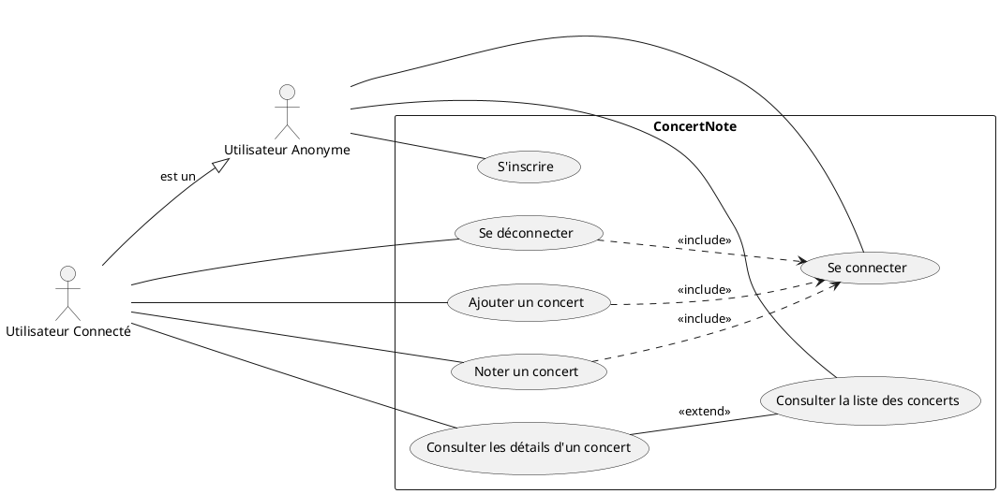
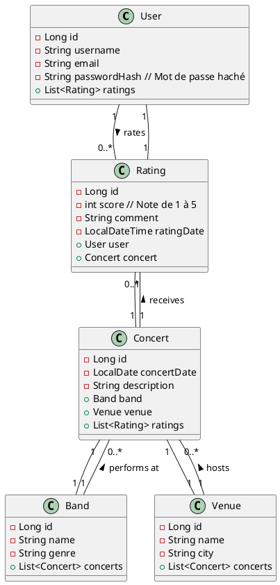
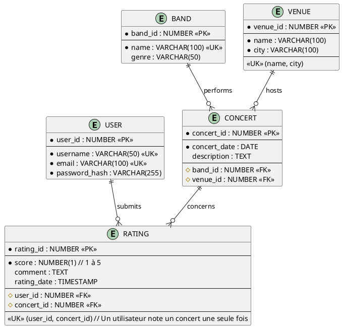
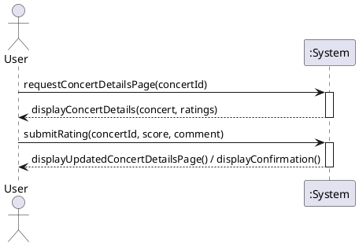
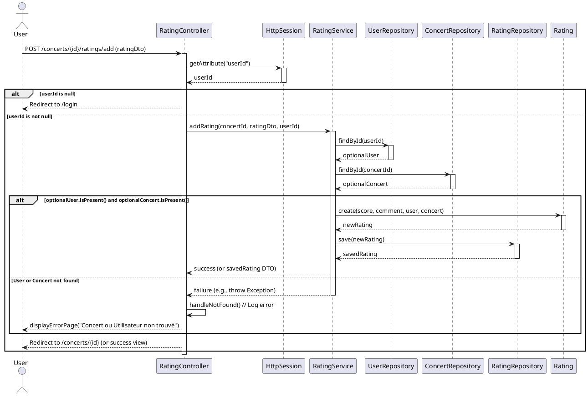

# Un projet Note de concert

## Enoncé du Projet (Project Statement)

**ConcertNote** est une application web simple permettant aux utilisateurs de répertorier et de noter des concerts.
Chaque concert est caractérisé par un groupe musical, un lieu et une date. Les utilisateurs doivent s'inscrire et se
connecter pour ajouter des concerts et des notes. L'application se concentre sur une interface web classique (rendu côté
serveur avec Thymeleaf) et une authentification basique sans Spring Security.

## Expression des besoins (Requirements)

**Besoins Fonctionnels (Functional Requirements):**

* **BF-01 :** Un utilisateur doit pouvoir créer un compte (nom d'utilisateur, email, mot de passe).
* **BF-02 :** Un utilisateur enregistré doit pouvoir se connecter avec son nom d'utilisateur et son mot de passe.
* **BF-03 :** Un utilisateur connecté doit pouvoir se déconnecter.
* **BF-04 :** Tout utilisateur (connecté ou non) doit pouvoir consulter la liste des concerts enregistrés (Groupe, Lieu,
  Date).
* **BF-05 :** Un utilisateur connecté doit pouvoir ajouter un nouveau concert en spécifiant un groupe existant, un lieu
  existant et une date.
    * *(Simplification pour 2 jours : on suppose que les groupes et lieux sont pré-existants ou ajoutés simplement via
      un champ texte qui crée l'entité si elle n'existe pas. Pour un projet de 2 jours, on peut se contenter de les
      sélectionner depuis une liste fixe ou pré-remplie).*
* **BF-06 :** Un utilisateur connecté doit pouvoir ajouter une note (un score de 1 à 5 et un commentaire optionnel) pour
  un concert spécifique.
* **BF-07 :** La page d'un concert doit afficher les détails du concert ainsi que les notes et commentaires laissés par
  les utilisateurs.
* **BF-08 :** Seuls les utilisateurs connectés peuvent ajouter des concerts et des notes. Les autres ne peuvent que
  consulter.

**Besoins Non-Fonctionnels (Non-Functional Requirements):**

* **BNF-01 :** L'application doit être développée avec Spring Boot.
* **BNF-02 :** L'interface utilisateur doit être une application web (pas d'API REST pour l'instant) utilisant Spring
  MVC et Thymeleaf.
* **BNF-03 :** La persistance des données doit être gérée avec Spring Data JPA. Une base de données H2 en mémoire peut
  être utilisée pour la simplicité du développement en 2 jours.
* **BNF-04 :** L'authentification doit être simple (pas de Spring Security). Par exemple, en stockant un identifiant
  utilisateur dans la session HTTP après une connexion réussie et en vérifiant sa présence pour les actions protégées.
  Le mot de passe doit être stocké de manière hachée (ex: BCrypt).
* **BNF-05 :** Le code source doit être écrit en anglais.
* **BNF-06 :** Les commentaires dans le code doivent être en français.
* **BNF-07 :** Le projet doit être réalisable en 2 jours de développement.

## Diagrammes UML

### Diagramme de Cas d'Utilisation

### Diagramme de Classe

### Modèle Logique de Données (MLD)

### Diagramme de Séquence Système - Exemple : Noter un Concert

### Diagramme de Séquence Détaillé - Exemple : Ajouter une Note

## User Stories

---

**US-01: Inscription Utilisateur**

* **En tant que** visiteur non enregistré,
* **Je veux** pouvoir créer un compte en fournissant un nom d'utilisateur, une adresse email et un mot de passe,
* **Afin de** pouvoir me connecter plus tard et accéder aux fonctionnalités réservées (ajouter/noter des concerts).

* **Critères d'Acceptance:**
    * Un formulaire d'inscription est accessible via un lien/menu.
    * Les champs nom d'utilisateur, email et mot de passe sont obligatoires.
    * Le format de l'email est validé basiquement.
    * Le nom d'utilisateur doit être unique dans le système.
    * L'adresse email doit être unique dans le système.
    * Le mot de passe doit avoir une longueur minimale (ex: 6 caractères).
    * Le mot de passe est stocké de manière sécurisée (haché).
    * Après une inscription réussie, l'utilisateur est redirigé vers la page de connexion ou la page d'accueil avec un
      message de succès.
    * En cas d'erreur (ex: utilisateur/email déjà existant), un message d'erreur clair est affiché sur le formulaire.

* **Tâches Techniques:**
    * Créer l'entité `User` avec les annotations JPA.
    * Créer le `UserRepository`.
    * Créer le `UserDto` pour le formulaire d'inscription.
    * Créer le `UserService` avec une méthode `registerUser(UserDto)` qui gère la validation, le hachage du mot de
      passe (ex: BCryptPasswordEncoder bean) et la sauvegarde.
    * Créer `AuthController` avec les mappings `GET /register` et `POST /register`.
    * Créer la vue Thymeleaf `register.html` avec le formulaire et la gestion des erreurs.
    * Ajouter les dépendances nécessaires (Web, Thymeleaf, Data JPA, H2, Validation, Spring Boot Starter Security pour
      BCrypt - même sans utiliser la sécurité complète).

---

**US-02: Connexion Utilisateur**

* **En tant qu'** utilisateur enregistré,
* **Je veux** pouvoir me connecter en utilisant mon nom d'utilisateur et mon mot de passe,
* **Afin d'** accéder aux fonctionnalités protégées comme l'ajout de concerts et de notes.

* **Critères d'Acceptance:**
    * Un formulaire de connexion est accessible via un lien/menu.
    * Les champs nom d'utilisateur et mot de passe sont requis.
    * Le système vérifie si l'utilisateur existe et si le mot de passe fourni correspond au hash stocké.
    * En cas de succès, un identifiant utilisateur (ou l'objet User simple) est stocké dans la session HTTP.
    * L'utilisateur est redirigé vers la page d'accueil (ou la page précédente) en tant qu'utilisateur connecté.
    * En cas d'échec (identifiants incorrects), un message d'erreur est affiché sur le formulaire de connexion.
    * L'interface change pour indiquer que l'utilisateur est connecté (ex: affiche nom d'utilisateur, lien de
      déconnexion).

* **Tâches Techniques:**
    * Créer le `LoginDto`.
    * Ajouter une méthode `loginUser(LoginDto)` dans `UserService` qui vérifie les identifiants.
    * Ajouter les mappings `GET /login` et `POST /login` dans `AuthController`. Gérer la mise en session (ex:
      `HttpSession.setAttribute("userId", user.getId())`).
    * Créer la vue Thymeleaf `login.html`.
    * Modifier le layout/header Thymeleaf pour afficher conditionnellement les liens connexion/inscription ou le nom
      d'utilisateur/déconnexion en vérifiant la présence de l'attribut de session.

---

**US-03: Déconnexion Utilisateur**

* **En tant qu'** utilisateur connecté,
* **Je veux** pouvoir me déconnecter,
* **Afin de** mettre fin à ma session sécurisée.

* **Critères d'Acceptance:**
    * Un lien/bouton "Déconnexion" est visible lorsque l'utilisateur est connecté.
    * Cliquer sur ce lien invalide la session HTTP de l'utilisateur.
    * L'utilisateur est redirigé vers la page d'accueil (ou de connexion) en tant qu'utilisateur anonyme.
    * L'interface revient à l'état non connecté.

* **Tâches Techniques:**
    * Ajouter un mapping `GET /logout` dans `AuthController`.
    * Implémenter l'invalidation de la session (ex: `HttpSession.invalidate()`).
    * Assurer la redirection correcte.

---

**US-04: Consulter la Liste des Concerts**

* **En tant que** visiteur (connecté ou non),
* **Je veux** voir une liste de tous les concerts enregistrés, affichant le nom du groupe, le nom du lieu et la date,
* **Afin de** me tenir informé des événements passés ou futurs.

* **Critères d'Acceptance:**
    * Une page `/concerts` affiche une liste ou une table des concerts.
    * Chaque entrée de la liste montre au minimum le nom du groupe, le nom du lieu et la date du concert.
    * La page est accessible sans être connecté.
    * Les concerts sont triés (par exemple, par date décroissante).

* **Tâches Techniques:**
    * Créer les entités `Concert`, `Band`, `Venue` avec relations et annotations JPA.
    * Créer les repositories `ConcertRepository`, `BandRepository`, `VenueRepository`.
    * Créer un `ConcertService` avec une méthode `getAllConcerts()`.
    * Créer un `ConcertDto` (ou utiliser directement les entités si simple) pour l'affichage.
    * Créer `ConcertController` avec un mapping `GET /concerts`.
    * Créer la vue Thymeleaf `concerts.html` pour afficher la liste.
    * (Optionnel) Ajouter un `DataLoader` (implémentant `CommandLineRunner`) pour insérer quelques données de test (
      Groupes, Lieux, Concerts) au démarrage.

---

**US-05: Ajouter un Concert**

* **En tant qu'** utilisateur connecté,
* **Je veux** pouvoir accéder à un formulaire pour ajouter un nouveau concert en spécifiant le groupe, le lieu et la
  date,
* **Afin d'** enrichir la base de données des concerts.

* **Critères d'Acceptance:**
    * Un lien/bouton "Ajouter Concert" est visible uniquement pour les utilisateurs connectés.
    * Le formulaire d'ajout contient des champs pour sélectionner un groupe existant (dropdown), sélectionner un lieu
      existant (dropdown) et choisir une date.
    * La validation empêche la soumission si des informations requises manquent.
    * Seuls les utilisateurs connectés peuvent soumettre le formulaire avec succès.
    * Après l'ajout réussi, le nouveau concert est enregistré en base de données.
    * L'utilisateur est redirigé vers la liste des concerts où le nouveau concert apparaît.

* **Tâches Techniques:**
    * Créer un `ConcertFormDto` pour le binding du formulaire.
    * Ajouter une méthode `addConcert(ConcertFormDto)` dans `ConcertService`.
    * Ajouter les mappings `GET /concerts/add` et `POST /concerts/add` dans `ConcertController`.
    * Le `GET` doit récupérer la liste des `Band` et `Venue` existants pour peupler les dropdowns et les passer au
      modèle.
    * Le `POST` doit valider le DTO, appeler le service et rediriger.
    * Implémenter la vérification de connexion dans les méthodes du contrôleur (vérifier la session).
    * Créer la vue Thymeleaf `add-concert.html` avec le formulaire et les dropdowns.
    * Gérer les éventuelles erreurs de validation dans la vue.

---

**US-06: Noter un Concert**

* **En tant qu'** utilisateur connecté,
* **Je veux** pouvoir ajouter une note (score 1-5) et un commentaire optionnel à un concert spécifique,
* **Afin de** partager mon opinion sur cet événement.

* **Critères d'Acceptance:**
    * Sur la page d'un concert (ou à côté de chaque concert dans la liste), un formulaire de notation est visible
      *uniquement* si l'utilisateur est connecté.
    * Le formulaire contient un champ pour le score (ex: radio buttons, select 1-5) et un champ texte pour le
      commentaire.
    * Le score est obligatoire, le commentaire est optionnel.
    * La note est associée au concert et à l'utilisateur connecté.
    * Un utilisateur ne peut noter un concert qu'une seule fois (critère optionnel pour 2 jours, plus simple de
      permettre plusieurs notes).
    * Après soumission, la note est enregistrée.
    * La page du concert (ou la liste) est rafraîchie et affiche la nouvelle note (et éventuellement la moyenne des
      notes).
    * Les notes existantes pour un concert sont visibles (score, commentaire, nom d'utilisateur?).

* **Tâches Techniques:**
    * Créer l'entité `Rating` avec relations et annotations JPA.
    * Créer le `RatingRepository`.
    * Créer un `RatingDto` pour le formulaire.
    * Créer `RatingService` avec une méthode `addRating(RatingDto, concertId, userId)`.
    * Ajouter un mapping (ex: `POST /concerts/{concertId}/ratings`) dans `ConcertController` ou un `RatingController`
      dédié.
    * Implémenter la vérification de connexion.
    * Modifier la vue `concerts.html` ou créer une vue `concert-details.html` pour afficher les détails du concert, les
      notes existantes et le formulaire d'ajout de note (conditionnellement).
    * Modifier le `ConcertService` ou le contrôleur pour charger les notes associées à un concert lors de son affichage.

## Planning de Réalisation (2 Jours / 4 Demi-Journées)

**Jour 1 - Matin (3.5h) : Setup & Structure de Base**

1. **Setup Projet (0.5h) :** Créer le projet Spring Boot via Spring Initializr (Web, Thymeleaf, Data JPA, H2,
   Validation, Lombok - optionnel). Configuration de base (`application.properties` pour H2 console, etc).
2. **Entités & Repositories (1.5h) :** Créer les 5 entités (`User`, `Band`, `Venue`, `Concert`, `Rating`) avec les
   relations `@ManyToOne`, `@OneToMany`, etc. et les annotations JPA (`@Entity`, `@Id`, etc.). Créer les interfaces
   `JpaRepository` correspondantes.
3. **Structure de Base (1h) :** Mettre en place l'arborescence du projet (controllers, services, repositories, dtos,
   templates). Créer un template de layout Thymeleaf de base (header, footer, contenu).
4. **DataLoader Initial (1h) :** Créer une classe `DataLoader` (implémentant `CommandLineRunner`) pour insérer quelques
   `Band` et `Venue` fixes afin de pouvoir tester l'ajout de concerts plus tard. Hacher un mot de passe pour un
   utilisateur de test.

**Jour 1 - Après-midi (3.5h) : Authentification Simple**

1. **Service Utilisateur (1.5h) :** Implémenter `UserService` : méthode `registerUser` (avec hachage BCrypt) et méthode
   `loginUser` (vérification du hash). Injection du `BCryptPasswordEncoder`.
2. **Contrôleur d'Authentification (1.5h) :** Créer `AuthController` : Mappings `GET/POST /register`, `GET/POST /login`,
   `GET /logout`. Implémenter la logique de session (`HttpSession`).
3. **Vues d'Authentification (1h) :** Créer les pages Thymeleaf `register.html` et `login.html` avec les formulaires.
   Mettre à jour le layout pour afficher/masquer les liens en fonction de l'état de connexion (vérification de
   l'attribut de session).

**Jour 2 - Matin (3.5h) : Gestion des Concerts (Liste & Ajout)**

1. **Service Concert (1h) :** Implémenter `ConcertService` : méthode `getAllConcerts` (avec tri par date) et méthode
   `addConcert`.
2. **Contrôleur Concert (List & Add Forms) (1.5h) :** Créer `ConcertController` : mapping `GET /concerts` pour afficher
   la liste. Mappings `GET /concerts/add` (préparation du formulaire avec listes de Bands/Venues) et
   `POST /concerts/add` (validation, appel service, redirection). Ajouter la vérification de connexion pour l'ajout.
3. **Vues Concert (1.5h) :** Créer la page Thymeleaf `concerts.html` pour afficher la liste. Créer la page
   `add-concert.html` avec le formulaire (dropdowns pour Band/Venue, champ date).

**Jour 2 - Après-midi (3.5h) : Notation & Finalisation**

1. **Service & Entité Rating (1h) :** Finaliser l'entité `Rating` si nécessaire. Implémenter `RatingService` avec la
   méthode `addRating`.
2. **Contrôleur & Formulaire Notation (1.5h) :** Ajouter le mapping pour soumettre une note (ex: dans
   `ConcertController` ou `RatingController`). Ajouter la vérification de connexion. Intégrer le formulaire de notation
   dans la vue `concerts.html` (ou une vue détail `concert-detail.html` si créée).
3. **Affichage des Notes (1h) :** Modifier le service/contrôleur pour charger les notes d'un concert. Afficher les notes
   existantes sur la page du concert.
4. **Tests & Raffinements (0.5h) :** Tests manuels des différents flux. Ajout de messages de feedback simples (
   succès/erreur). Nettoyage mineur du code et des vues. Vérification des commentaires en français.

## Suggestions d'améliorations

**Améliorations Fonctionnelles (User-Facing Features)**

1. **Gestion des Groupes et Lieux :**
    * **Fonctionnalité :** Permettre aux utilisateurs (ou admin) d'ajouter/modifier/supprimer des groupes et des lieux
      via des formulaires dédiés, au lieu de se baser sur une liste fixe ou une création implicite lors de l'ajout de
      concert.
    * **Valeur :** Base de données plus propre et maintenable. Permet d'enrichir les informations sur les groupes (
      genre, description, image) et les lieux (adresse, capacité, type).

2. **Pages Dédiées Groupe/Lieu :**
    * **Fonctionnalité :** Créer des pages qui listent tous les concerts d'un groupe spécifique ou tous les concerts
      ayant eu lieu dans un lieu spécifique.
    * **Valeur :** Facilite la navigation et la découverte d'informations ciblées.

3. **Recherche / Filtrage / Tri :**
    * **Fonctionnalité :** Ajouter une barre de recherche pour trouver des concerts par nom de groupe ou lieu. Permettre
      de filtrer la liste des concerts (par date, par genre de groupe, par ville du lieu) et de trier les résultats (par
      date, par note moyenne, par nom).
    * **Valeur :** Améliore considérablement l'utilisabilité, surtout si la liste de concerts grandit.

4. **Note Moyenne et Affichage :**
    * **Fonctionnalité :** Calculer et afficher la note moyenne pour chaque concert et/ou chaque lieu et/ou chaque 
      groupe directement dans la liste et sur la page de détail.
    * **Valeur :** Donne un aperçu rapide de l'appréciation d'un concert, d'un lieu ou d'un groupe.

5. **Modification/Suppression de sa propre Note :**
    * **Fonctionnalité :** Permettre à un utilisateur connecté de modifier ou supprimer une note qu'il a précédemment
      laissée sur un concert.
    * **Valeur :** Offre plus de contrôle à l'utilisateur sur son propre contenu.

6. **Profil Utilisateur Simple :**
    * **Fonctionnalité :** Une page où l'utilisateur connecté peut voir la liste des concerts qu'il a notés. (
      Optionnel : modifier son email/mot de passe).
    * **Valeur :** Personnalisation et historique pour l'utilisateur.

7. **Pagination :**
    * **Fonctionnalité :** Si la liste des concerts ou des notes devient longue, implémenter la pagination pour
      améliorer les performances et la lisibilité.
    * **Valeur :** Indispensable pour les applications avec beaucoup de données.

8. **Ajout de détails au Concert :**
    * **Fonctionnalité :** Ajouter des champs optionnels au concert comme une description, un lien vers l'événement
      Facebook, un lien billetterie, voire une setlist (pourrait être une entité liée).
    * **Valeur :** Enrichit l'information disponible pour chaque concert.

9. **Restriction de Notation Unique :**
    * **Fonctionnalité :** Implémenter la contrainte (via la base de données ou la logique service) qu'un utilisateur ne
      peut noter un concert qu'une seule fois.
    * **Valeur :** Assure l'intégrité des notes moyennes.

**Améliorations Techniques / Infrastructure**

1. **Validation Avancée :**
    * **Fonctionnalité :** Utiliser les annotations de validation de Bean Validation (`@NotNull`, `@Size`, `@Email`,
      `@Min`, `@Max`, etc.) sur les DTOs et activer la validation dans les contrôleurs (`@Valid`). Afficher des messages
      d'erreur plus précis à l'utilisateur.
    * **Valeur :** Améliore la robustesse et l'expérience utilisateur en cas d'erreur de saisie.

2. **Tests Unitaires et d'Intégration :**
    * **Fonctionnalité :** Écrire des tests pour les services (logique métier) et les contrôleurs/repositories (tests
      d'intégration avec `@SpringBootTest`).
    * **Valeur :** Assure la qualité du code, prévient les régressions, facilite la maintenance.

3. **Gestion des Exceptions :**
    * **Fonctionnalité :** Mettre en place un gestionnaire d'exceptions global (`@ControllerAdvice`) pour intercepter
      les erreurs communes (ex: `EntityNotFoundException`) et retourner des pages d'erreur standardisées ou des messages
      appropriés.
    * **Valeur :** Améliore l'expérience utilisateur en cas de problème et centralise la gestion des erreurs.

4. **Base de Données Persistante :**
    * **Fonctionnalité :** Remplacer la base H2 en mémoire par une base de données réelle comme PostgreSQL ou MySQL pour
      une persistance durable des données.
    * **Valeur :** Rend l'application utilisable en production.

